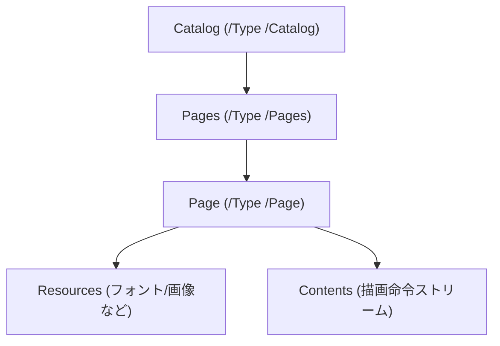

## はじめに

[LayerX Tech Advent Calendar](https://layerx.notion.site/6975c0901ea54ca9b609fafc3e8a35c3?v=2bccdd370bae80579556000cc2afc504) の 18 日目の記事です。

今年の 4 月に新卒として入社し、先月からバクラク事業部の Payment 開発部で新規事業の開発をしています。[@tak848](https://github.com/TAK848)です。最近は「takのPDF」という謎のSlackスタンプを押されることが増えました。

みなさん、普段仕事やAIツールでPDFを扱う機会は多いと思いますが、「PDFの中身がどうなっているか」を意識したことはありますか？
私たちは当たり前のようにPDFを作成・閲覧していますが、その裏側にある構造を知る機会は意外と少ないものです。

直近の社内LTのネタを考える中で、「PDF のオブジェクトは参照を辿ると木構造っぽく見える」ことを思い出しました。
そこで、PDF を XML 風に並べ替えて見せれば理解しやすいのではと思い、社内で発表しました。
この記事ではそのLTを肉付けして、PDF ファイルを独自のオレオレ XML として表します。  
対象は「HTML のような XML 形式ならちょっと分かる。でも PDF の構造は考えたことがない」という方です。  
内部構造からあるある現象までを理解できることを目指します。

最近はとにかく話題がAIだらけですが、たまにはPDFという枯れた技術にも目を向けていきましょう！

:::message
この記事では、内部の構造が読みやすいように構造を簡略化したり、厳密なデータ表現から変えたりしている箇所があります。  
「仕様レベルの正確さで読みたい」方向けには [PDF の仕様についてもっと知りたくなったら](#pdf-の仕様についてもっと知りたくなったら) に参考資料を置いています。
:::

## この記事で触れること / 触れないこと

### 触れる

- PDF がどんな部品でできているかをつかむ
- 参照関係を辿ると木構造っぽく見えることをつかむ
- XML 風に表して読んでみる
- よくある現象（OCR、黒塗り、テキスト抽出の違和感）がなぜ起きるかを内部構造から理解できる

### 触れない

- PDF の仕様を網羅的に解説・理解する
- PDF のバージョンごとの差違について深掘りする
- PDF のパーサやレンダラを実装する
- 署名、フォーム、注釈、添付ファイルやメタデータなどのさまざまなオブジェクトについて深掘りする

## まずは部品を見る

PDF はバイナリ形式のファイルです。  
ただし、オブジェクト番号・辞書（`<< >>`）・参照（`n n R`）・`xref` や `trailer` といった骨格はテキストで書かれています。条件がそろえば、エディタで読めそうに見えることもあります。

とはいえ実際の PDF では、`stream ... endstream` で囲まれた「ストリーム」という箱に、長いバイト列が入ります。  
この中身は圧縮されていることが多く、テキストエディタで見ると文字化けしたように見えます。  
さらに、PDF 1.5 以降ではオブジェクトをまとめて格納する（オブジェクトストリーム）こともあります。  
そのため、素のまま読むのは難しいことが多いです。

### 最小のPDF

以下は、最小の「Hello」という文字を表示するPDFの例です。

```text
%PDF-1.7

1 0 obj
<< /Type /Catalog /Pages 2 0 R >>
endobj

2 0 obj
<< /Type /Pages /Kids [ 3 0 R ] /Count 1 >>
endobj

3 0 obj
<< /Type /Page /Parent 2 0 R /MediaBox [ 0 0 595 842 ] /Contents 4 0 R >>
endobj

4 0 obj
<< /Length 44 >>
stream
BT /F1 24 Tf 100 700 Td (Hello) Tj ET
endstream
endobj

xref
...
trailer
...
%%EOF
```

:::message
これは説明用にかなり省略した例です。実際には `/Resources` でフォント辞書を定義して `/F1` を参照したり、`xref` にオブジェクトのバイトオフセットが並んだり、`startxref` で最後の xref の位置を指したりします。
:::

これを見てもパッとは分かりませんが、

1. `1 0 obj` の単位でオブジェクトが並ぶ
2. `2 0 R` の形式で参照が張られる

この 2 点を押さえると、PDF が謎のテキストの塊ではなく参照で繋がったデータ構造に見え始めてきます。

## PDFの構成

多くの PDF は、ざっくり次の 4 つのパートを持ちます（派生もあります）。

- Header：`%PDF-1.7` のようなバージョン情報
- Body：オブジェクト本体（ページ、フォント、画像など）
- xref：オブジェクトの位置を示す住所録（一種のポインタのようなものだと思ってもらってよいです）
- Trailer：`/Root`（入口はどれか）などの全体情報

重要なのは、入口（`/Root`）から参照を辿ると必要なものに到達できる点です。

### 追記更新で履歴が残ることがある

追記更新（増分更新）では、末尾に新しいオブジェクト群と xref・trailer を追加します。編集のたびに末尾へ積み増されます。
過去の xref へは `trailer` の `/Prev` から辿れます。

この仕組みにより、過去のデータが履歴として残ることがあります。後述する「黒塗りしたのにデータが残っている」問題に繋がります。

### xref がストリームのこともある

PDF 1.5 以降では、xref が表ではなくストリームの場合があります。  
その形式だと `xref` というキーワードが見えないことがあります。代わりに `/Type /XRef` を持つストリームオブジェクトが登場します。

## Body は参照で繋がる

Body には間接オブジェクトが並んでいます。

- `3 0 obj` の `3` はオブジェクト番号
- `0` は世代番号（generation）。オブジェクトが削除・再利用されると増える
- `2 0 R` は `2 0 obj` への間接参照
- `<< ... >>` は辞書
- `[ ... ]` は配列
- `stream ... endstream` はストリーム（長いバイト列。圧縮されていることが多い）

参照が多いので、見た目がフラットに見えるものの、組み立てなおすと実体はグラフ構造です。

## 参照を辿るとページツリーになる

PDF でまず押さえると良いのはページ周りです。典型的には次のように繋がります。



ページ周りが木っぽく見えるのは、`/Pages` と `/Kids` がページツリーとして設計されているためです。  
ただし Resources は共有されることもあります。PDF 全体は木ではなくグラフです。

### Resources は継承されることがある

Page オブジェクトに `/Resources` が無い場合があります。  
このケースでは、親の `/Pages` から継承していることがあります。Page の中だけで判断しないのがコツです。

### Acrobat Proなどでオブジェクト構造は確認できる

Acrobat Pro などの PDF ビューアでは、PDF のオブジェクト構造を確認できます。例えば以下のような構造になっています。


## XML 風に再構成してみる

PDF をそのまま読むのは大変です。そこで参照を辿って、構造が分かる形に再構成します。

```xml
<pdf version="1.7">
  <catalog>
    <pages count="1">
      <page number="1" width="595" height="842">
        <resources>
          <font name="F1" />
        </resources>
        <contents>
          <text x="100" y="700" font="F1" size="24">Hello</text>
        </contents>
      </page>
    </pages>
  </catalog>
</pdf>
```

:::message
この XML は理解のための擬似表現です。Tagged PDF の構造ツリーとは別です。
**PDF が内部的に XML で保存されているわけではありません。**あくまで「参照関係を理解するための擬似的な表現」です。

※ここでは分かりやすく `<text>Hello</text>` と書いていますが、実際にはここには単純なテキストではなく、バイト列や文字コードの指定が入ることがあります（後述）。
:::

## Resources と Contents

PDF を読む上で重要なのは、素材置き場と描画命令が分かれている点です。

### Resources は素材に名前を付ける

Resources は、フォントや画像などに名前を付けます。  
たとえば「このページでは `F1` という名前でこのフォントを使う」といった具合です。

### Contents は命令を並べて描く

Contents は、描画命令を順番に並べます。  
なお `/Contents` は 1 つのコンテンツストリームとは限らず、複数のストリーム参照を配列で持つこともあります。  
この場合も、配列の順番に解釈されます。
たとえば「`F1` でこの座標に文字を書け」といった命令になります。

```xml
<page>
  <resources>
    <font name="F1" ref="FontObject_123" />
    <xobject name="Im1" ref="ImageObject_456" />
  </resources>
  <contents>
    <text font="F1" x="100" y="700">...</text>
    <drawImage ref="Im1" x="0" y="0" />
  </contents>
</page>
```

### なぜ分かれているのか

再利用性を高めるため、Resources と Contents に分かれています。  
例えば同じフォントを 100 ページで使うなら、フォント本体を 1 回だけ持ち、各ページは参照だけで済ませたいはずです。

## Contents は文章ではなく描画命令

Contents の中身はコンテンツストリームです。内部には描画命令（オペレータ）が並びます。

### テキスト描画の例

```text
BT              % テキストオブジェクト開始
/F1 24 Tf       % フォントF1、サイズ24
100 700 Td      % 位置移動
(Hello) Tj      % 文字列を描画
ET              % テキストオブジェクト終了
```

ここで大事なのは、PDF が基本的に意味ではなく見た目を記述している点です。

- HTML は「これは段落」などの意味を持つ
- PDF は「この座標にこれを描け」で見た目を作る

見た目の再現性は高い一方で、文章として扱うのは得意ではありません。余談ですが、文章構造を PDF に残すために Tagged PDF（構造ツリー）という仕組みもあります（後述）。

## よくある現象

### OCR 済み PDF で選択できる文字がある理由・その構造

OCR 済み PDF は次の構成になることが多いです。

1. ページ全面のスキャン画像を貼る
2. その上に OCR 結果のテキストを不可視で重ねる（選択はできる）

```xml
<contents>
  <drawImage ref="ScanImage" x="0" y="0" width="595" height="842" />
  <text x="120" y="700" textRenderingMode="3">請求書</text>
</contents>
```

PDF の命令列では、テキスト描画モードを不可視にする指定（例：`3 Tr`）で実現されることが多いです。
ただし、ツールによっては「非常に小さいフォント」や「白い文字」を使って、見た目上は見えないようにして埋め込んでいるケースもあります。いずれにせよ、人間には見えないテキストデータが裏側に存在しています。

ただ、最近は macOS 標準の「プレビュー」など、画像でも自動的に文字を読み取って選択可能にしてくれる機能が充実してきています。そのため、意識することが減ってきているかもしれません。

余談ですが、最近では大学の講義資料に「透明な文字」でAIへの指令（プロンプト）を埋め込む事例が話題になりました。
これは、学生が課題をAIに解かせようとしてPDFを読み込ませた際、人間には見えない不可視文字によってAIが「意図しない回答」を出力するように仕向けるものです。PDFの仕組みを逆手に取った、一種のプロンプトインジェクションと言えます。

参考:
https://ledge.ai/articles/invisible_prompt_ai_trap_keio

#### 選択範囲がズレる理由

ズレの原因は座標の話であることが多いです。たとえば次の要因があります。

- OCR の推定位置がずれている
- ページ回転（`/Rotate`）が入っている
- 座標変換（`cm`）が入っている
- 画像の縮尺とテキスト座標の縮尺が噛み合わない

### 黒塗りしたのにコピーできる・データが残っている

黒い四角を上から被せるだけだと、下のテキストは残ります。

```xml
<contents>
  <text x="100" y="700">社外秘</text>
  <rectangle x="100" y="700" width="200" height="30" fill="black" />
</contents>
```

描画はレイヤーの上に重ねられるので見た目は隠れます。
しかしデータは残るので、抽出できることがあります。

#### 追記更新が絡むとさらに厄介

[前述した追記更新](#追記更新で履歴が残ることがある)が絡むと、ツールによっては削除したつもりの元データが過去の状態として残ることがあります。

XML 風に表すと、追記更新による黒塗りは次のようなイメージです。

```xml
<pdf version="1.7">
  <!-- 最初の状態 -->
  <revision number="1">
    <page number="1">
      <contents>
        <text x="100" y="700">社外秘</text>
      </contents>
    </page>
    <trailer root="catalog_1" />
  </revision>

  <!-- 追記更新：黒塗りを追加（差分のみ記録） -->
  <revision number="2" prev="revision_1">
    <page number="1">
      <contents>
        <rectangle x="100" y="700" width="200" height="30" fill="black" />
      </contents>
    </page>
    <trailer root="catalog_1" prev="xref_1" />
  </revision>
</pdf>
```

このように、追記更新では差分だけが末尾に追加されます。最新の状態を見るには revision 1 と revision 2 を合成しますが、revision 1 はファイル内に残っているため、黒塗りを被せただけでは元のテキストを履歴から復元できてしまうことがあります。

大学の講義資料でも似たような現象が起きます。
教授が「穴埋め問題」として配布するために、正解のテキストの上に図形を重ねて隠すケースです。これも見た目上は隠れていますが、データとしては裏にテキストが残っています。そのため、編集ツールで図形を削除するだけで「完全な講義資料」が復元できてしまうことがあります（授業はきちんと受けましょう！）。

:::message alert
機密情報を後から抽出できない状態にしたいなら、単に図形で上から隠すだけの方法は避けるべきです。
Acrobat などの PDF ビューアにある墨消し（Redact）機能などで、元データを削除した上で黒塗りしてください。追記更新（増分更新）が絡む場合は、履歴まで含めて消すために最適化（保存し直し）が必要になることもあります。
:::

### テキスト抽出すると順番がバラバラになる理由

PDF は座標指定で描画します。ファイル内の命令の順番と、見た目の上下は一致しません。

さらに文章っぽさが失われる理由もあります。

- 1 文字ずつ別々に描画することがある
- 空白は座標移動で表現されることがある
- `TJ` で文字間隔を細かく調整することがある
- 表は罫線と文字の寄せ集めとして描かれることが多い

そのため、単純に上から読む前提で抽出すると崩れやすくなります。

#### 改行という概念がない

PDF には「改行」という概念がありません。見た目の改行は、単に Y 座標を変えて次の行を描画しているだけです。
1 つのテキストオブジェクト内で座標移動することもあれば、複数のテキストオブジェクトに分かれていることもあります。

```xml
<contents>
  <!-- 見た目は2行だが、論理的な「改行」の情報はない -->
  <text x="100" y="700">これは1行目の</text>
  <text x="100" y="680">文章です。</text>
</contents>
```

この 2 つをどう繋げるかは、PDF ビューア次第です。Y 座標の差から「別の行だ」と推測するしかありません。

- ビューア A:「これは1行目の 文章です。」（空白で繋ぐ）
- ビューア B:「これは1行目の\n文章です。」（改行で繋ぐ）
- ビューア C:「これは1行目の文章です。」（そのまま繋ぐ）

同じ PDF でもビューアによって抽出結果が異なるのは、このような「解釈の余地」があるためです。PDF ビューアの苦労が垣間見えます。

## そして深淵へ

ここまでの XML 風表現では `<text>Hello</text>` のように書きました。  
ただ、PDF の中の `(Hello)` は Unicode 文字列とは限りません。実体としては文字コード（バイト列）です。

レンダリングはフォントの対応関係で描けます。  
一方で「このバイト列は Unicode として何か」を一意に言えるかは別問題です。

その結果、次のような現象が起きます。

- コピペすると文字化けする
- 検索できない
- 同じ見た目でも抽出結果が違う

:::details もう少しだけ正確に（ToUnicode とか）
PDF のテキストはコンテンツストリーム中の文字列として現れます。  
ただし実体は character codes の並びです。

Unicode に落ちるかどうかは、主に次の要素に依存します。

- フォントの種類（単純フォント / Type0 など）
- フォント辞書に `ToUnicode` CMap があるか
- サブセット化などで対応関係が失われていないか

`ToUnicode` が適切に入ると、ビューアは抽出時に正しく Unicode へ変換しやすくなります。  
`ToUnicode` が無い場合、ビューアは推測するしかありません。結果としてコピペが壊れることがあります。

Tagged PDF（構造ツリー）が入ると読み上げやリフローに役立つことがあります。  
ただし、すべての PDF に入るわけではありません。**論理構造を持ってはいますが、実務上は未整備・不完全な PDF も非常に多いため、過信は禁物です。**
:::

## PDF の仕様についてもっと知りたくなったら

仕様レベルで確認したい方向けのメモです。

- PDF 1.7 は ISO 32000-1:2008
- PDF 2.0 は ISO 32000-2（PDF Association 経由で無償入手できます）

読むのが大変な場合は、次の観点から拾うと繋がりやすいです。

- 辞書 / 配列 / ストリーム（基本データ型）
- ページツリー（`/Catalog` → `/Pages` → `/Page`）
- コンテンツストリームのオペレータ（`BT/ET/Tj/TJ/cm/Do` など）
- フォントと `ToUnicode`
- xref（テーブルとストリーム）
- 追記更新（`/Prev` チェーン）

### 資料

PDFインフラストラクチャ解説 電子の紙PDFとその周辺技術を語り尽す 第1.1版
https://web.antenna.co.jp/shop/html/products/detail.php?product_id=836

PDF構造解説
https://www.oreilly.co.jp/books/9784873115498/

仕様書（原本）
https://pdfa.org/resource/pdf-specification-index/

チートシート
https://pdfa.org/resource/pdf-cheat-sheets/

## おわりに

PDF を XML 風に表して、内部構造と現象を繋げてみました。  
ここまでの前提が入ると、OCR や黒塗り、抽出の違和感が、「仕様的にそうなる」へ寄っていくはずです。

もし需要があれば、フォントと ToUnicode のさらに深い話や、PDF から文字をちゃんと読み取る実装の苦労もまとめたいと思っています。

お読みいただきありがとうございました！
