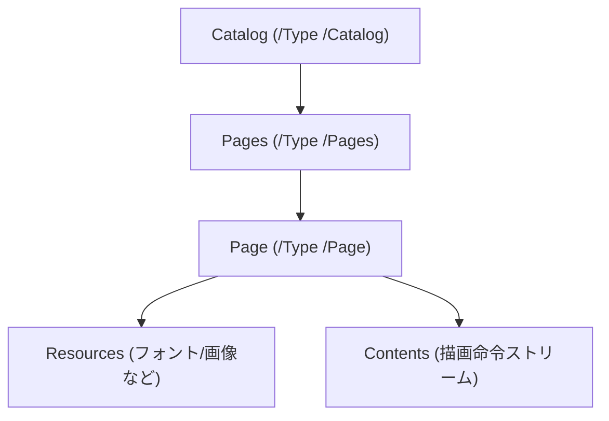

## はじめに

[LayerX Tech Advent Calendar](https://layerx.notion.site/6975c0901ea54ca9b609fafc3e8a35c3?v=2bccdd370bae80579556000cc2afc504)の 18 日目の記事です。

今年の 4 月に新卒として入社し、先月からバクラク事業部の Payment 開発部で新規事業の開発をしています。[@tak848](https://github.com/TAK848)です。

突然ですがみなさん、最近は〜〜〜PDF の構造って意識したことありますか？
PDF があるととりあえず色んなツールで作成したり編集したり閲覧したり、変換したりと十人十色の操作をしますが、意外と PDF の内部構造をしっかり意識したことって無い方も多いのでは？と思います。

この記事では、HTML のような XML 形式ならちょっと分かる！けど PDF の構造なんて考えたことも調べたことも無かった！という方々に向けて、PDF ファイルをオレオレ XML として表してみて内部構造を少しでも理解してもらえるよう解説していきます！

最近はとにかく話題が AI ですが、たまには PDF という枯れた技術にも目を向けてみましょう、Let's Go!!

:::message
この記事では、内部の構造が読みやすいように構造を簡略化したり、厳密なデータ表現から変えたりしている箇所があります。厳密な構造が知りたいよ！という方は[PDF の仕様についてもっと知りたくなったら](#pdf-の仕様についてもっと知りたくなったら)をご覧ください。
:::

## この記事でやること / やらないこと

やること:

- PDF が「どんな部品でできているか」を掴む
- 参照関係を辿ると _木構造っぽく_ 見えることを体験する
- それを XML 風に表して「読む」練習をする
- よくある現象（OCR、黒塗り、テキスト抽出が変…）がなぜ起きるかを腹落ちさせる

やらないこと:

- PDF の仕様を網羅する（無理）
- PDF のパーサ/レンダラ実装（今回は扱いません）

## まずは「生の PDF」を覗く

PDF はバイナリだと思われがちですが、少なくとも「中核の構造」はテキストとして読めることが多いです（もちろん圧縮されてたり、バイナリが埋まってたり、色々あります）。

例えば、最小限の「Hello」みたいな PDF は、概ね次のような雰囲気になります（かなり簡略化しています）。

```text
%PDF-1.7

1 0 obj
<< /Type /Catalog /Pages 2 0 R >>
endobj

2 0 obj
<< /Type /Pages /Kids [ 3 0 R ] /Count 1 >>
endobj

3 0 obj
<< /Type /Page /Parent 2 0 R /MediaBox [ 0 0 595 842 ] /Contents 4 0 R >>
endobj

4 0 obj
<< /Length 44 >>
stream
BT /F1 24 Tf 100 700 Td (Hello) Tj ET
endstream
endobj

xref
...
trailer
...
%%EOF
```

ぱっと見では読みにくいのが普通です。

ただ、読み解くためのポイントは 2 つあります。

1. `1 0 obj` みたいな単位で **オブジェクト** が並んでいる
2. `2 0 R` みたいな書き方で、オブジェクト同士が **参照** している

この 2 つさえ掴めれば、PDF は「フラットなテキストの塊」から「参照で繋がったデータ構造」に見え始めます。

## PDF はだいたい 4 つのパートに分かれている

多くの PDF はざっくり次の 4 パートの構造を持ちます（例外や派生はあります）。

- Header: `%PDF-1.7` などのバージョン情報
- Body: オブジェクト本体（テキスト/画像/ページ情報など、色々入ってる）
- xref: オブジェクトがファイル内のどこにあるかの「住所録」
- Trailer: `/Root`（入口はどれ？）など、ファイル全体の情報

ここで重要なのは、**入口（Root）から参照を辿っていくと必要なものに到達できる**、という点です。

## 手元の PDF で 4 部構成を確かめる

ここまでの話を、手元の PDF を使って軽く確かめてみます。

:::message
PDF をそのままテキストエディタで開くと、圧縮やバイナリの混在で読みにくいことがあります。そういうときは、PDF を「読みやすい形に整形してから」眺めると捗ります。
:::

### `qpdf` で「読みやすい PDF」にする

`qpdf` を使うと、PDF の内容を（比較的）読みやすい形式に正規化できます。

```bash
# input.pdf を「人間が見やすいレイアウト」に整形する（QDFモード）
qpdf --qdf --object-streams=disable input.pdf output.qdf.pdf
```

この `output.qdf.pdf` は PDF として成立したまま、テキストを読みやすい形にできることが多いです。エディタで開いて眺められます。

:::details インストール例
macOS:

```bash
brew install qpdf
```

Ubuntu/Debian:

```bash
sudo apt-get update
sudo apt-get install -y qpdf
```

:::

### Header / xref / Trailer を探す

整形後の `output.qdf.pdf` に対して、次の文字列を探すと、先ほどの 4 部構成が目で追えるようになります。

```bash
rg -n '^(%PDF-|xref|trailer|startxref|%%EOF)' output.qdf.pdf
```

- `%PDF-1.7` のような行が **Header**
- `xref` から始まるブロック（見つかれば）が **xref（テーブル形式）**
- `trailer` の直後にある `<< ... >>` が **Trailer**
  - 特に `/Root` は入口（Catalog）への参照です
- `startxref` は、xref の開始位置（バイトオフセット）を示します

:::message
PDF によっては `xref` がテーブルではなく「xref ストリーム」になっていることがあります。その場合 `xref` という文字列が出てこないこともありますが、`/Type /XRef` を探すと見つけられます。
:::

```bash
rg -n '/Type\\s*/XRef' output.qdf.pdf
```

## Body は「オブジェクトの寄せ集め」で、参照で繋がる

PDF の Body には「間接オブジェクト（Indirect Object）」が並びます。

- `3 0 obj` の `3` はオブジェクト番号、`0` は世代番号（generation）です
- `2 0 R` は「`2 0 obj` を参照せよ」という **間接参照（Indirect Reference）** です
- `<< ... >>` は辞書（dictionary）、`[ ... ]` は配列（array）です
- `stream ... endstream` はストリーム（長いデータ、圧縮されてたりします）です

PDF はこの参照だらけの世界なので、ぱっと見は「一枚岩のテキスト」に見えても、実態は **グラフ構造** です。

## 参照を辿ると「ページツリー」になる

PDF でまず押さえると良いのは「ページまわり」です。多くの PDF では次のように繋がっています。



これ、もうだいぶ「木」に見えませんか？

もちろん実際には「ページが複数ある」「Resources が親から継承される」「Contents が複数ストリームになる」「途中で別オブジェクトを挟む」など色々ありますが、入口は概ねこの形です。

## XML 風に再構成してみる

ここからが本題です。

PDF をそのまま読むのは大変なので、参照を辿って「構造が分かる形」に **勝手に再構成** します。

例えば先ほどの構造を、XML 風に書くとこうです。

```xml
<pdf version="1.7">
  <catalog>
    <pages count="1">
      <page number="1" width="595" height="842">
        <resources>
          <font name="F1" />
        </resources>
        <contents>
          <text x="100" y="700" font="F1" size="24">Hello</text>
        </contents>
      </page>
    </pages>
  </catalog>
</pdf>
```

この XML は当然「PDF を変換した実ファイル」ではなく、あくまで理解のための **オレオレ XML（擬似表現）** です。
でも、これだけで急に「PDF って _ページというキャンバスに、素材を使って、命令を順に描画するもの_ なんだな」という雰囲気が出てきます。

## PDF を読む上で重要な分離: Resources と Contents

PDF を読む上で重要なのが、**素材置き場（Resources）と描画命令（Contents）が分かれている**点です。

- Resources: 「このページでは `F1` という名前でこのフォントを使う」「`Im1` はこの画像」など、素材に名前を付ける
- Contents: 「`F1` でこの座標に文字を書け」「`Im1` をこのサイズで貼れ」など、描画命令の列

XML 風に並べると、こんな対比になります。

```xml
<page>
  <resources>
    <font name="F1" ref="FontObject_123" />
    <xobject name="Im1" ref="ImageObject_456" />
  </resources>
  <contents>
    <text font="F1" x="100" y="700">...</text>
    <drawImage ref="Im1" x="0" y="0" />
  </contents>
</page>
```

### なんで分かれてるの？

要点は **再利用** のためです。

例えばフォントファイルは数 MB になることもありますが、同じフォントを 100 ページで使うなら、

- フォント本体は 1 回だけ埋め込む
- 各ページは「それを使ってね」と参照するだけ

で済ませたいですよね。Resources/参照の世界観は、この要求に素直です。

## Contents は「文章」ではなく「描画命令」

Contents の正体は「コンテンツストリーム」と呼ばれることが多く、内部には PDF の描画命令が並んでいます。

先ほど例に出した（`BT ... ET` などの）部分は、テキスト描画の命令です。

```text
BT              % テキストオブジェクト開始
/F1 24 Tf       % フォントF1、サイズ24
100 700 Td      % 位置移動
(Hello) Tj      % 文字列を描画
ET              % テキストオブジェクト終了
```

この時点で、HTML の `<p>Hello</p>` とは別物だと分かります。

- HTML: 「これは段落」「これは見出し」みたいな _意味_ を持つ
- PDF: 「この座標にこのサイズでこれを描け」みたいな _見た目_ を作る

なので PDF は、見た目の再現性は高い一方で、機械が「文章」として理解するのは苦手です。

## よくある PDF 現象を説明できるようになる

ここまでで「PDF はキャンバス」「Resources と Contents」「描画命令」という前提ができました。
この前提があると、よく見る謎現象がけっこう説明できます。

### OCR した PDF で「選択できる文字」があるのはなぜ？

OCR 済み PDF は、ざっくりこういう構造になっていることが多いです。

1. まずスキャン画像（ページ全面の画像）を貼る
2. その上に、OCR の結果テキストを「見えないように」重ねる（でも選択はできる）

オレオレ XML で言うとこんな感じです。

```xml
<contents>
  <drawImage ref="ScanImage" x="0" y="0" width="595" height="842" />
  <text x="120" y="700" renderMode="invisible">請求書</text>
</contents>
```

これで「見た目は画像なのに、選択すると文字が取れる」現象が説明できます。
逆に言うと、座標がズレると「選択範囲がズレる」事故も起きます。

### 黒塗りしたのにコピーできる（黒塗り事故）

黒い四角を上から被せただけだと、下のテキストは消えていません。

```xml
<contents>
  <text x="100" y="700">社外秘</text>
  <rectangle x="100" y="700" width="200" height="30" fill="black" />
</contents>
```

PDF は「後から描いたものが上に重なる」ので、見た目は隠れます。
でもデータは残っているので、抽出できてしまうことがあります。

:::message alert
黒塗り（秘匿）が目的なら「上から塗る」ではなく、専用のリダクション（redaction）機能で **元データを削除** してください。
:::

### テキスト抽出すると順番がバラバラ

PDF は座標指定で描画するので、ファイル内の命令の順番と、見た目の上下は一致しません。

「上から順に読む」という前提で抽出すると、ぐちゃっとすることがあります。

## そして深淵へ: PDF は本当に「文字」を持っているのか？

ここまでのオレオレ XML では、`<text>Hello</text>` のように書いてきました。

……が、ここから少しだけ正確さを増やします。

PDF の中で `(Hello)` みたいに見えるものは、「文字列」というより **バイト列** です。
そのバイト列をどう解釈するかは、基本的に「フォント（とそのエンコーディング）」に委ねられます。

極端に言うと、PDF はこういう世界です。

- PDF: 「このフォントで、コード `0x2A` の _図形_ をこの位置に描け」
- ビューア: 「`0x2A` が何の文字か、復元できるなら頑張って復元する（できないこともある）」

だからこそ、PDF によっては

- コピペすると文字化けする
- 検索できない
- 同じ見た目なのに抽出結果が違う

みたいなことが起きます。

:::details もう少しだけ正確に（ToUnicode とか）
PDF の「テキスト」は、コンテンツストリーム中の「文字列（string）」として現れますが、その実体は文字コード（character codes）の並びです。

それが Unicode に落ちるかどうかは主に次の要素に依存します。

- フォントがどの種類か（単純フォント / 合成フォント（Type0）など）
- フォント辞書に `ToUnicode` CMap があるか
- 埋め込みフォントやサブセットフォントの都合で、元の Unicode との対応が失われていないか

`ToUnicode` が適切に入っていると、ビューアは「このコード列はこの Unicode だ」と確信を持ってテキスト抽出できます。
一方で `ToUnicode` が無い（または壊れている）場合、ビューアはフォントの情報などから推測するしかなく、コピペが壊れたりします。

また「Tagged PDF（構造ツリー）」という別レイヤの情報が入っていると、読み上げやリフロー（再配置）などに役立ちますが、すべての PDF に入っているわけではありません。
:::

## PDF の仕様についてもっと知りたくなったら

ちゃんと知りたくなった方へ（ここから先は仕様レベルの話になります）。

- PDF 1.7 は ISO 32000-1:2008
- PDF 2.0 は ISO 32000-2:2020

仕様を読むのは大変ですが、「辞書/配列/ストリーム」「ページツリー」「フォントと ToUnicode」「xref（テーブルとストリーム）」あたりを見に行くと、今回の話がピタッと繋がると思います。

参考リンク（ちゃんとした資料に当たりたくなったら）は以下です。

- https://web.antenna.co.jp/shop/html/products/detail.php?product_id=836
- https://www.oreilly.co.jp/books/9784873115498/

また、ローカルで PDF を覗くなら、次の系のツールが便利です（ここでは名前だけ）。

- `qpdf`（構造を見やすくしたり、正規化したり）
- `pdfcpu`（解析・操作）
- `mutool`（MuPDF 付属ツール。テキスト抽出や情報表示など）

## おわりに

今回は、PDF をオレオレ XML として表してみましたが、少しでも PDF の内部構造を理解してもらえたでしょうか？

もし需要があれば、今回さらっと触れただけの「xref がテーブルじゃなくストリームなやつ」「フォントと ToUnicode のさらに深い話」「PDF から文字をちゃんと読み取る実装の苦労」みたいな深淵編も書いてみようかなと思っています。

お読みいただきありがとうございました。
