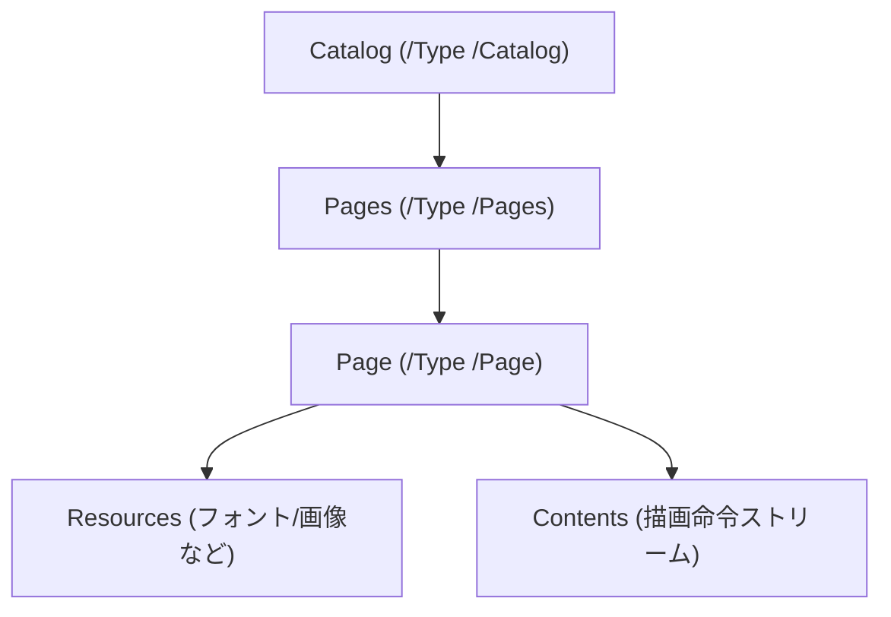

## はじめに

[LayerX Tech Advent Calendar](https://layerx.notion.site/6975c0901ea54ca9b609fafc3e8a35c3?v=2bccdd370bae80579556000cc2afc504) の 18 日目の記事です。

今年の 4 月に新卒として入社し、先月からバクラク事業部の Payment 開発部で新規事業の開発をしています。[@tak848](https://github.com/TAK848)です。最近は「takのPDF」という謎Slackスタンプを押されることが増えました。

みなさん、最近はAIのツールの台頭もあってPDFの書類や本をよく手にするようになったと思いますが、そもそもそのPDF の内部構造って意識したことありますか？
PDF があるととりあえず色んなツールで作成したり編集したり閲覧したり、変換したりと十人十色の操作をしますが、PDF の内部構造をちゃんと意識したことって意外と少ないのでは？と思っています。

直近の社内LTのネタを考える中で、PDFのオブジェクトは木構造風に表せることを思い出し、PDFをXML風に表して伝えれば皆に理解してもらいやすくなるのでは！と思い発表しました。
この記事ではそのLTから大幅に肉付けし、HTML のような XML 形式ならちょっと分かる！けど PDF の構造なんて考えたことも調べたことも無かった！という方向けに、PDF ファイルを独自のオレオレXMLとして表して、「内部構造 → あるある現象」が繋がる感覚を目指そうと思います。

最近はとにかく話題が AI ですが、たまには PDF という枯れた技術にも目を向けていきましょう！

:::message
この記事では、内部の構造が読みやすいように構造を簡略化したり、厳密なデータ表現から変えたりしている箇所があります。  
「仕様レベルの正確さで読みたい」方向けには [PDF の仕様についてもっと知りたくなったら](#pdf-の仕様についてもっと知りたくなったら) に参考資料を置いています。
:::

## この記事でやること / やらないこと

やること:

- PDF が「どんな部品でできているか」を掴む
- 参照関係を辿ると _木構造っぽく_ 見えることを体験する（ただし全体はグラフ）
- それを XML 風に表して「読む」練習をする
- よくある現象（OCR、黒塗り、テキスト抽出が変…）がなぜ起きるか腹落ちさせる

やらないこと:

- PDF の仕様を網羅する（無理）
- PDF のパーサ/レンダラ実装（今回は扱いません）
- “すべてのPDF”を完全に説明する（暗号化/署名/フォーム/注釈/埋め込みファイル等は深掘りしない）

---

## まずは前提: PDFは「テキストっぽく見えることもあるバイナリ」

PDF は **バイナリ形式のファイル**です。  
ただし、オブジェクト番号・辞書（`<< >>`）・参照（`n n R`）・`xref`/`trailer` などの骨格はテキストで書かれるため、条件がそろうとエディタで「読めそう」に見えることがあります。

とはいえ現実の PDF は、

- ストリーム（後述）が圧縮されている -（PDF 1.5 以降では）オブジェクトを **オブジェクトストリーム**にまとめて格納している
- xref が “表” ではなく **xref ストリーム**になっている
- 暗号化されている（パスワード PDF）
- 追記更新（incremental update）で履歴が積まれている

…などが普通にあり、**そのままでは人間には読みづらい**のが一般的です。

---

## 最小の PDF を眺めて「部品」をつかむ

例えば、最小限の「Hello」みたいな PDF は、概ね次のような雰囲気になります（かなり簡略化しています）。

```text
%PDF-1.7

1 0 obj
<< /Type /Catalog /Pages 2 0 R >>
endobj

2 0 obj
<< /Type /Pages /Kids [ 3 0 R ] /Count 1 >>
endobj

3 0 obj
<< /Type /Page /Parent 2 0 R /MediaBox [ 0 0 595 842 ] /Contents 4 0 R >>
endobj

4 0 obj
<< /Length 44 >>
stream
BT /F1 24 Tf 100 700 Td (Hello) Tj ET
endstream
endobj

xref
...
trailer
...
%%EOF
```

ぱっと見では読みにくいのが普通です。  
ただ、読み解くためのポイントは **2つ** だけです。

1. `1 0 obj` みたいな単位で **オブジェクト** が並んでいる
2. `2 0 R` みたいな書き方で、オブジェクト同士が **参照** している

この 2 つさえ掴めれば、PDF は「フラットなテキストの塊」から **参照で繋がったデータ構造** に見え始めます。

:::message
ここで「PDFって結局なに？」を一言で言うと、  
**“ページというキャンバスに対して、素材（フォント/画像など）を参照しつつ、描画命令を順番に実行して見た目を作るフォーマット”** です。
:::

---

## PDFはだいたい4つのパートに分かれている

多くの PDF はざっくり次の 4 パートの構造を持ちます（例外や派生はあります）。

- Header: `%PDF-1.7` などのバージョン情報
- Body: オブジェクト本体（ページ/フォント/画像/注釈/メタデータなど何でも入る）
- xref: オブジェクトがファイル内のどこにあるかの「住所録」
- Trailer: `/Root`（入口はどれ？）など、ファイル全体の情報

重要なのは、**入口（/Root）から参照を辿っていくと必要なものに到達できる**、という点です。

### 追記更新（incremental update）を知っておくと事故らない

現場でよく出会う “ややこしさ” がここです。PDF は追記更新（incremental update）で、**編集履歴を末尾に追加**できます。  
つまり、ファイルの後ろに

- Body（追加/差し替えオブジェクト）
- xref（追加分の住所録）
- trailer（追加分の全体情報）

が **もう一回** 出てきます。さらに編集されると **何回でも**増えます。

過去の状態へは `trailer` の `/Prev` から辿れます。

### xrefが「表」じゃないこともある（xref stream）

PDF 1.5 以降では、xref が “xref table” ではなく **xref stream** になっていることがあります。  
この場合、`xref` というキーワードが見えないことがあり、代わりに `/Type /XRef` を持つストリームオブジェクトが登場します。

---

## 手元のPDFで「4部構成」と入口（/Root）を確かめる

:::message
PDF をそのままテキストエディタで開くと、圧縮やバイナリの混在で読みにくいことがあります。  
そういうときは PDF を「読みやすい形に整形してから」眺めると捗ります。
:::

### `qpdf` で「読みやすいPDF」にする（QDFモード）

`qpdf` を使うと、PDF の内容を（比較的）読みやすい形式に正規化できます。

```bash
# input.pdf を「人間が追いやすいレイアウト」に整形する（QDFモード）
qpdf --qdf --object-streams=disable input.pdf output.qdf.pdf
```

:::message
QDF は「PDF をテキストに変換」するものではなく、**PDFのまま、追いやすい書式に整形するデバッグ用フォーマット**です。

- 読みやすいレイアウトに整形される -（可能なら）ストリームが展開される / 改行が正規化される
- ストリーム長が間接オブジェクトになったり、コメントが挿入されたりする

…など “見た目” は変わりますが、PDFとしての意味は保たれます。
:::

:::details インストール例
macOS:

```bash
brew install qpdf
```

Ubuntu/Debian:

```bash
sudo apt-get update
sudo apt-get install -y qpdf
```

:::

### Header / xref / Trailer を探す

整形後の `output.qdf.pdf` に対して、次の文字列を探すと、先ほどの 4 部構成が目で追えるようになります。

```bash
rg -n --text '^(%PDF-|xref|trailer|startxref|%%EOF)' output.qdf.pdf
```

- `%PDF-1.7` のような行が **Header**
- `xref` から始まるブロック（見つかれば）が **xref（テーブル形式）**
- `trailer` の直後にある `<< ... >>` が **Trailer**
  - 特に `/Root` は入口（Catalog）への参照です
- `startxref` は、xref の開始位置（バイトオフセット）を示します

:::message
xref ストリームの場合、`xref` という文字列は出てこないことがあります。  
その場合 `xref` ではなく `/Type /XRef` を探すと見つけやすいです。
:::

```bash
rg -n --text '/Type\\s*/XRef' output.qdf.pdf
```

### もう一歩ラクする（qpdfの「見る」系オプション）

エディタで頑張るのも良いですが、`qpdf` には「参照を追うための表示」もあります。

```bash
# trailer を見て /Root を知る
qpdf --show-object=trailer input.pdf

# xref を人間向けに出す（xref streamでもOK）
qpdf --show-xref input.pdf

# 各ページの「Page辞書」と「Contentsストリーム」のオブジェクト番号を出す
qpdf --show-pages input.pdf

# あるストリームオブジェクトの中身を（展開して）見る
qpdf --show-object=4 --filtered-stream-data input.pdf
```

※このへんは “便利なおまけ” なので、飛ばしてもOKです。

---

## Bodyは「オブジェクトの寄せ集め」で、参照で繋がる

PDF の Body には「間接オブジェクト（Indirect Object）」が並びます。

- `3 0 obj` の `3` はオブジェクト番号、`0` は世代番号（generation）
- `2 0 R` は「`2 0 obj` を参照せよ」という **間接参照（Indirect Reference）**
- `<< ... >>` は辞書（dictionary）、`[ ... ]` は配列（array）
- `stream ... endstream` はストリーム（長いデータ。圧縮されていることが多い）

PDF は参照だらけの世界なので、ぱっと見は「一枚岩のテキスト」に見えても、実態は **グラフ構造**です。

---

## 参照を辿ると「ページツリー」に到達する

PDF でまず押さえると良いのは「ページまわり」です。多くの PDF では次のように繋がっています。



ここが “木っぽい” のは、`/Pages` と `/Kids` が **ページツリー**として設計されているからです。  
ただし、Resources（フォント・画像など）は複数ページで共有されたりするので、PDF全体としては **木ではなくグラフ**になります。

### Resources は “継承” されることがある

よくある初見のハマりポイント：

- Page オブジェクトを見たら `/Resources` が無い
- なのに Contents では `/F1` みたいなフォントが使われている

これは **親の /Pages ノードから Resources を継承**しているケースがあるためです。  
「Pageに無い = 無い」と決めつけないのがコツです。

---

## XML風に再構成してみる（オレオレXML）

ここからが本題です。

PDF をそのまま読むのは大変なので、参照を辿って「構造が分かる形」に **勝手に再構成**します。  
例えば先ほどの構造を、XML 風に書くとこうです。

```xml
<pdf version="1.7">
  <catalog>
    <pages count="1">
      <page number="1" width="595" height="842">
        <resources>
          <font name="F1" />
        </resources>
        <contents>
          <text x="100" y="700" font="F1" size="24">Hello</text>
        </contents>
      </page>
    </pages>
  </catalog>
</pdf>
```

この XML は「PDF を変換した実ファイル」ではなく、あくまで理解のための **擬似表現**です。  
でも、これだけで急に「PDFって _ページというキャンバスに、素材を使って、命令を順に描画するもの_ なんだな」という雰囲気が出てきます。

:::message
ここで作るオレオレ XML は、参照を辿って「それっぽい木」として **こちらが再構成した擬似表現**です。  
PDF に入っている Tagged PDF（構造ツリー / Structure Tree）とは別物です。
:::

---

## PDFを読む上で重要な分離: Resources と Contents

PDF を読む上で重要なのが、**素材置き場（Resources）と描画命令（Contents）が分かれている**点です。

- Resources: 「このページでは `F1` という名前でこのフォントを使う」「`Im1` はこの画像」など、素材に名前を付ける
- Contents: 「`F1` でこの座標に文字を書け」「`Im1` をこのサイズで貼れ」など、描画命令の列

XML 風に並べると、こんな対比になります。

```xml
<page>
  <resources>
    <font name="F1" ref="FontObject_123" />
    <xobject name="Im1" ref="ImageObject_456" />
  </resources>
  <contents>
    <text font="F1" x="100" y="700">...</text>
    <drawImage ref="Im1" x="0" y="0" />
  </contents>
</page>
```

### なんで分かれてるの？

要点は **再利用**のためです。

フォントファイルは数 MB になることもありますが、同じフォントを 100 ページで使うなら、

- フォント本体は 1 回だけ埋め込む
- 各ページは「それを使ってね」と参照するだけ

で済ませたいですよね。Resources/参照の世界観は、この要求に素直です。

---

## Contentsは「文章」ではなく「描画命令」だと思うと腹落ちする

Contents の正体は「コンテンツストリーム」と呼ばれることが多く、内部には PDF の描画命令（オペレータ）が並んでいます。

先ほど例に出した `BT ... ET` は、テキスト描画の命令です。

```text
BT              % テキストオブジェクト開始
/F1 24 Tf       % フォントF1、サイズ24
100 700 Td      % 位置移動
(Hello) Tj      % 文字列を描画
ET              % テキストオブジェクト終了
```

ここで大事なのは、HTML の `<p>Hello</p>` と違って、PDFは

- 「段落」「見出し」みたいな **意味** を基本持たず
- 「この座標にこのサイズでこれを描け」みたいな **見た目** を作る

という点です。  
なので PDF は **見た目の再現性は高い**一方で、機械が「文章」として理解するのは苦手です。

### “描画命令っぽさ” が強い代表例（黒塗りにも関係）

テキスト以外にも、

- `q` / `Q`（グラフィックス状態の保存/復元）
- `cm`（座標変換）
- `Do`（XObjectを描画＝画像やフォームを貼る）
- `re` + `f`（四角形を塗りつぶす）

などが普通に並びます。

つまり Contents は「文」ではなく、**絵を描くための命令列**です。

---

## よくある PDF 現象が説明できるようになる

ここまでで

- PDFはキャンバス
- Resources と Contents の分離
- Contentsは描画命令

という前提ができました。  
この前提があると、よく見る謎現象がけっこう説明できます。

### OCRしたPDFで「選択できる文字」があるのはなぜ？

OCR 済み PDF は、ざっくりこういう構造になっていることが多いです。

1. まずスキャン画像（ページ全面の画像）を貼る
2. その上に、OCR の結果テキストを「見えないように」重ねる（でも選択はできる）

オレオレ XML で言うとこんな感じです。

```xml
<contents>
  <drawImage ref="ScanImage" x="0" y="0" width="595" height="842" />
  <text x="120" y="700" textRenderingMode="3">請求書</text>
</contents>
```

PDF の命令列としては、テキスト描画のモードを「不可視」にする指定（例：`3 Tr`）で実現されることが多いです。

これで「見た目は画像なのに、選択すると文字が取れる」現象が説明できます。  
逆に言うと、座標がズレると「選択範囲がズレる」事故も起きます。

:::message
ズレが起きる理由はだいたいこのへんです（全部 “座標” の話）:

- OCR が推定した文字位置がそもそもずれている
- ページの回転（/Rotate）や座標変換（cm）が入っていて、見た目と座標系の対応がややこしい
- 画像の解像度・拡大縮小とテキスト座標のスケールが噛み合っていない
  :::

### 黒塗りしたのにコピーできる（黒塗り事故）

黒い四角を上から被せただけだと、下のテキストは消えていません。

```xml
<contents>
  <text x="100" y="700">社外秘</text>
  <rectangle x="100" y="700" width="200" height="30" fill="black" />
</contents>
```

PDF は「後から描いたものが上に重なる」ので、見た目は隠れます。  
でもデータは残っているので、抽出できてしまうことがあります。

さらに厄介なのが、PDF は追記更新（incremental update）で編集履歴を末尾に追加できる点です。  
ツールによっては「削除したつもりの元データ」が**過去の状態としてファイル内に残る**ことがあります。

:::message alert
黒塗り（秘匿）が目的なら「上から塗る」ではなく、専用のリダクション（redaction）機能で **元データを削除**してください。  
必要なら「履歴も含めて最適化/サニタイズして保存する」タイプの機能を使うのが安全です。
:::

### テキスト抽出すると順番がバラバラ

PDF は座標指定で描画するので、ファイル内の命令の順番と、見た目の上下は一致しません。

さらに、PDFのテキスト描画は次のような理由で “文章っぽさ” が失われがちです。

- 1 文字ずつ別々に描画されることがある
- スペースは “空白文字” ではなく「ちょっと座標を移動」で表現されることがある
- `TJ` で文字間隔が細かく調整されていて、見た目の単語境界が復元しづらい
- 表は “表” としてではなく、罫線と文字の寄せ集めとして描かれていることが多い

なので「上から順に読む」前提で抽出すると、ぐちゃっとすることがあります。

---

## そして深淵へ: PDFは本当に「文字」を持っているのか？

ここまでのオレオレ XML では、`<text>Hello</text>` のように書いてきました。

……が、もう少しだけ正確に言うと、PDF の中の `(Hello)` は「Unicode文字列」ではなく、基本的には **文字コード（バイト列）**です。  
そのバイト列が何の文字か（Unicodeとして何か）を確実に言えるかは、主に **フォント・エンコーディング・ToUnicode** に依存します。

- レンダリング（見た目）は「フォントの対応関係」に従って **描ける**
- でも、そのコード列が “Unicodeとして何か（コピペ/検索/抽出）” を確実に言えるかは別問題

だからこそ、PDF によっては

- コピペすると文字化けする
- 検索できない
- 同じ見た目なのに抽出結果が違う

みたいなことが起きます。

:::details もう少しだけ正確に（ToUnicode とか）
PDF の「テキスト」は、コンテンツストリーム中の「文字列（string）」として現れますが、その実体は “character codes” の並びです。

それが Unicode に落ちるかどうかは主に次の要素に依存します。

- フォントがどの種類か（単純フォント / 合成フォント（Type0）など）
- フォント辞書に `ToUnicode` CMap があるか
- 埋め込みフォントやサブセットフォントの都合で、元の Unicode との対応が失われていないか

`ToUnicode` が適切に入っていると、ビューアは「このコード列はこの Unicode だ」と確信を持ってテキスト抽出できます。  
一方で `ToUnicode` が無い（または壊れている）場合、ビューアは推測するしかなく、コピペが壊れたりします。

また「Tagged PDF（構造ツリー）」という別レイヤの情報が入っていると、読み上げやリフロー（再配置）などに役立ちますが、すべての PDF に入っているわけではありません。
:::

---

## PDF の仕様についてもっと知りたくなったら

ちゃんと知りたくなった方へ（ここから先は仕様レベルの話になります）。

- PDF 1.7 は ISO 32000-1:2008
- PDF 2.0 は ISO 32000-2:2020（PDF Association 経由で無償入手できます）

仕様を読むのは大変ですが、次のあたりを見ると今回の話がピタッと繋がります。

- 辞書/配列/ストリーム（PDFの基本データ型）
- ページツリー（/Catalog → /Pages → /Page）
- コンテンツストリームのオペレータ（BT/ET/Tj/TJ/cm/Do など）
- フォントと ToUnicode
- xref（テーブルとストリーム）
- incremental update（/Prev チェーン）

参考リンク（ちゃんとした資料に当たりたくなったら）:

- https://pdfa.org/resource/pdf-cheat-sheets/
- https://pdfa.org/resource/pdf-specification-archive/
- https://web.antenna.co.jp/shop/html/products/detail.php?product_id=836
- https://www.oreilly.co.jp/books/9784873115498/

ローカルで PDF を覗くなら、次の系のツールが便利です（ここでは名前だけ）。

- `qpdf`（構造を見やすくしたり、正規化したり）
- `pdfcpu`（解析・操作）
- `mutool`（MuPDF 付属ツール。テキスト抽出や情報表示など）

---

## おわりに

今回は、PDF をオレオレ XML として表してみましたが、少しでも PDF の内部構造を理解してもらえたでしょうか？

もし需要があれば、今回さらっと触れただけの

- xref がテーブルじゃなくストリームなやつ（xref stream）
- オブジェクトストリーム（ObjStm）を辿るときのコツ
- フォントと ToUnicode のさらに深い話
- PDF から文字をちゃんと読み取る実装の苦労（TJ・座標・CMap地獄）

みたいな深淵編も書いてみようかなと思っています。

お読みいただきありがとうございました。
